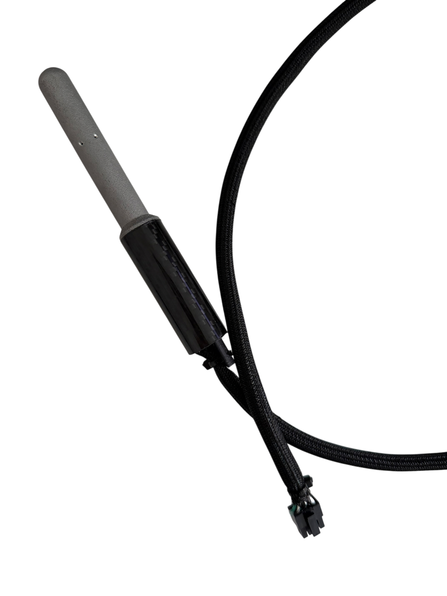

# Beyond Robotix Documentation

Documentation for [Beyond Robotix](https://www.beyondrobotix.com/) hardware and firmware.

## Heated Pitot

Keeps aircraft airspeed readings accurate through extreme icing and wet conditions, with DroneCAN control and precise heater power management.

* [Heated Pitot](heated-pitot/)

## Kahuna

A Wi-Fi telemetry unit for the Pixhawk ecosystem. Connect from any laptop or tablet with Mission Planner or QGroundControl, with multi-drone support and long range up to 2.5km.

* [Kahuna](kahuna/)
* [Quick Start Guide](kahuna/quick-start-guide.md)

## CAN Ecosystem

Hardware and firmware for building custom DroneCAN peripherals, from ready-made nodes to Arduino-based custom firmware.

* [CAN Ecosystem overview](can-ecosystem/)
* [Micro Node](can-ecosystem/micro-node.md) — a compact CAN node that mounts to a custom carrier board
* [Node Development Board V1.1](can-ecosystem/node-development-board-v1.1.md) — breaks out every Micro Node interface for development
* [CAN Node](can-ecosystem/l431-can-node.md) — the same STM32L431 as the Micro Node, in a standalone form factor
* [CAN Node Plus](can-ecosystem/can-node-plus.md) — dual CAN FD interfaces and an STM32H723 for more demanding applications
* [Arduino DroneCAN](can-ecosystem/arduino-dronecan/) — build custom firmware for any of our nodes with a familiar Arduino sketch
* [AP Periph](can-ecosystem/ap-periph.md) — the ready-made ArduPilot peripheral firmware our nodes ship with by default

## Air Data Module

A DroneCAN airspeed and altitude sensor built around the AllSensors AUAV pressure sensor, supporting a range of autopilots.

* [Air Data Module](air-data-module/)
* [Quick Start Guide](air-data-module/quick-start-guide.md)
* [Air Data Module Mini](air-data-module/air-data-module-mini.md) — a more compact, reliable redesign of the original module
* [Air Data Module Original](air-data-module/air-data-moulde-original.md) — the original two-layer design, mounted on a Micro Node

## RM3100 DroneCAN Compass

A plug-and-play DroneCAN magnetometer node built around the PNI RM3100 sensor, with the standard Pixhawk JST-GH connector.

* [RM3100 DroneCAN Compass](rm3100-dronecan-compass.md)

## Reference

* [Engineering Change Notice](engineering-change-notice.md) — hardware changes to our products (see GitHub releases for software changes)
