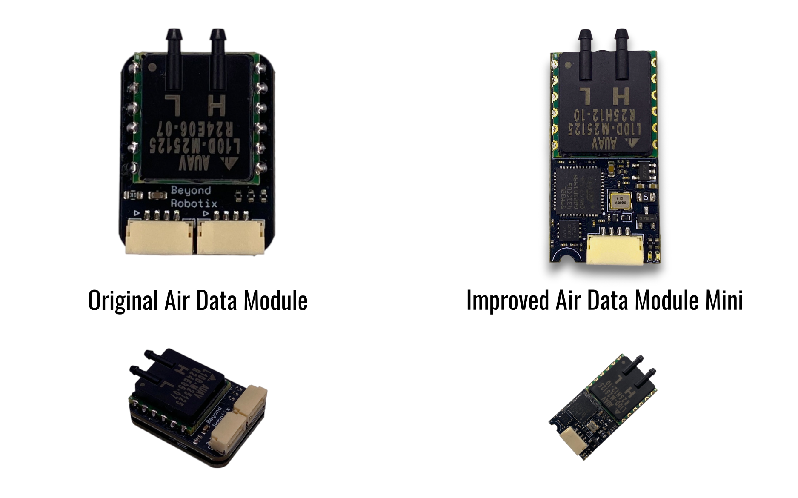
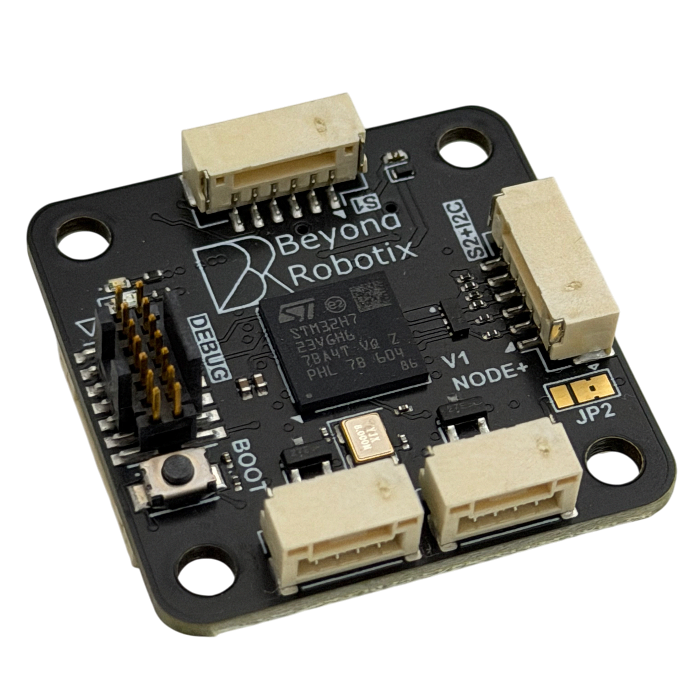

# Beyond Robotix Documentation

Beyond Robotix develops DroneCAN hardware and UAV telemetry products.

<figure><figcaption></figcaption></figure>

### Products

Build and operate connected UAV systems with these products:

* [kahuna](kahuna/ "mention") provides Wi-Fi telemetry for Pixhawk-compatible autopilots.
* [air-data-module](air-data-module/ "mention") measures airspeed and barometric altitude through DroneCAN.
* [rm3100-dronecan-compass.md](rm3100-dronecan-compass.md "mention") adds a plug-and-play CAN magnetometer.

<figure><figcaption>
CAN Node
</figcaption></figure> <figure><figcaption>
Air Data Module
</figcaption></figure>

### CAN development

The [can-ecosystem](can-ecosystem/ "mention") supports custom DroneCAN peripherals.

Choose the Micro Node for a custom carrier board. Choose CAN Node for a compact standalone design. Choose CAN Node Plus for dual CAN FD and H7 performance.

<figure><figcaption>
CAN Node Plus
</figcaption></figure>

Use [arduino-dronecan](can-ecosystem/arduino-dronecan/ "mention") to build custom firmware. It supports parameters, CAN bootloader updates, debugging, CAN FD, and dual-port H7 nodes. Use [ap-periph.md](can-ecosystem/ap-periph.md "mention") for supported peripherals without custom firmware.

### Get started

Start with the quick start guide for your hardware:

* [quick-start-guide.md](kahuna/quick-start-guide.md "mention")
* [quick-start-guide.md](air-data-module/quick-start-guide.md "mention")
* [thermocouple-tutorial.md](can-ecosystem/arduino-dronecan/thermocouple-tutorial.md "mention")
