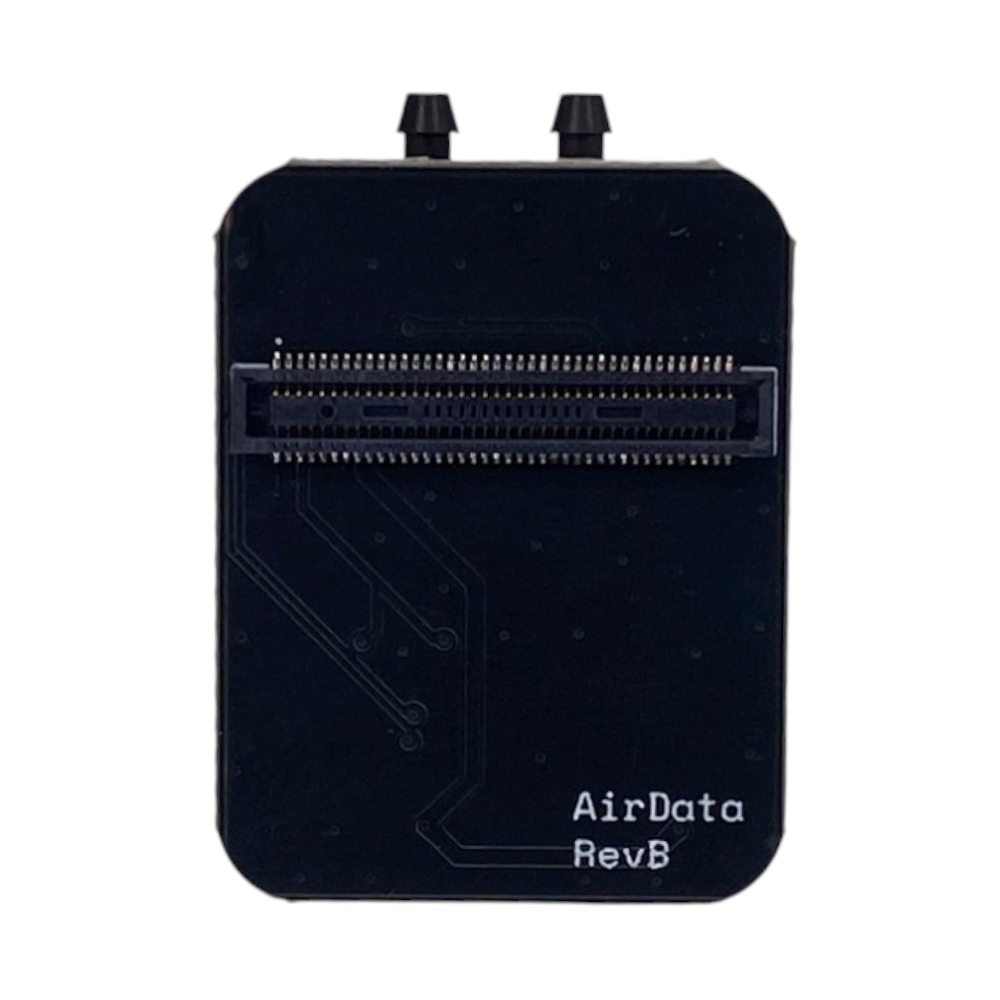
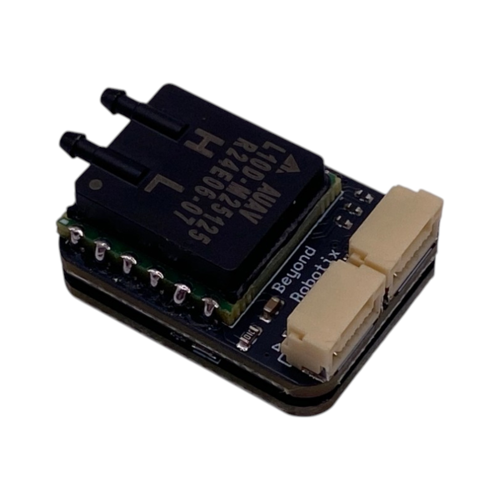

# Air Data Module

The Beyond Robotix Air Data Module makes use of differential and absolute pressure sensors to estimate airspeed and altitude. The module works over DroneCAN with a variety of autopilots.

<figure><figcaption></figcaption></figure> <figure><figcaption></figcaption></figure>

The Air Data Module is purchased with the CAN Micro Node. This board carries the micro controller and required interfaces.

<figure><figcaption></figcaption></figure>

There are three variands of the Air Data Module depending on airspeed.&#x20;

* Low speed: Up to 45m/s (88 kts)
* Medium speed: Up to 63 m/s (122 kts)
* High Speed: Up to 111 m/s (216 kts)

