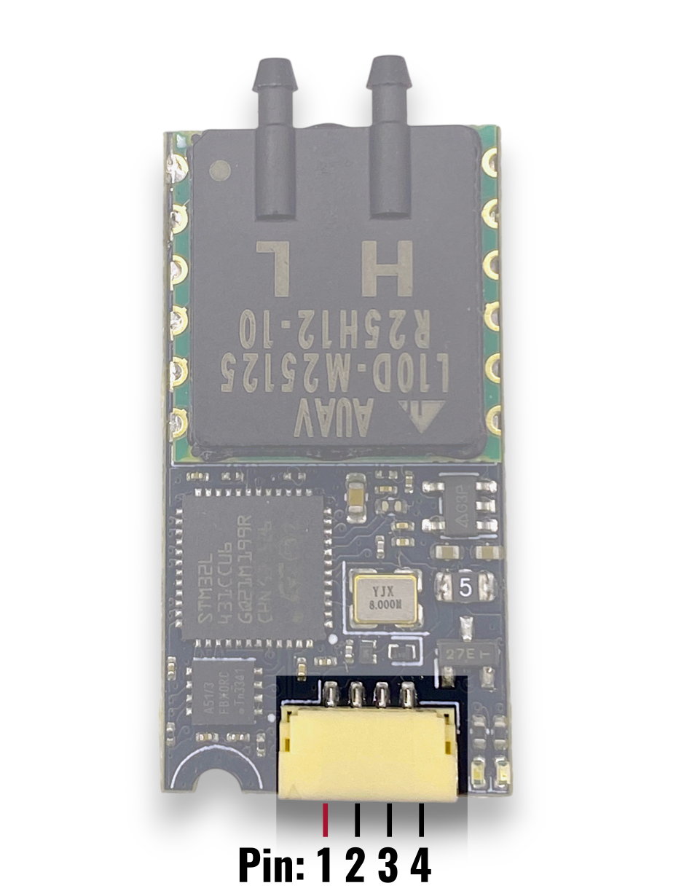
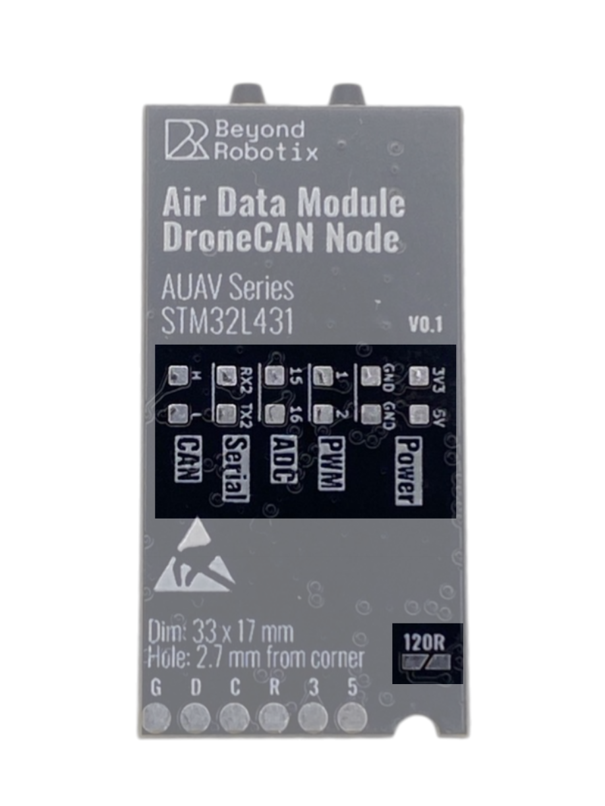
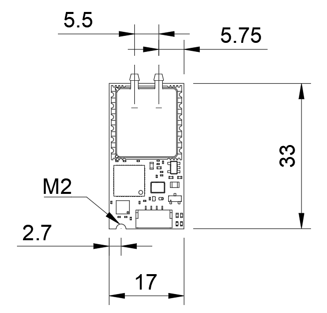

# Air Data Module Mini

The Air Data Module Mini is an all in one board that reads airspeed and barometric altitude and outputs over DroneCAN. The module has a number of protection features including over-current protection, over and under-voltage protections, reverse polarity protection and ESD protection.

<figure><figcaption></figcaption></figure>

## Specifications

* Mass: 3.8 g (Sensor module only)
* Dimensions: 33x17mm
* Power: 21mA (4.5 - 5.5 V)
* Operating Temperature: -40 °C to +85 °C
* Absolute Pressure Operating Range: 25kPa - 125kPa
* Connector: JST-GH 4 Pin (compatible with Pixhawk and Cube CAN port)

## Pinout

The main connector on the board is a JST-GH with the Pixhawk standard CAN pinout.

<table><thead><tr><th width="316" align="right">Pin</th><th>Function</th><th data-hidden>Notes</th></tr></thead><tbody><tr><td align="right">1</td><td>5V</td><td>Recommended: 4.5 - 6V</td></tr><tr><td align="right">2</td><td>CAN H</td><td></td></tr><tr><td align="right">3</td><td>CAN L</td><td></td></tr><tr><td align="right">4</td><td>GND</td><td></td></tr></tbody></table>

<figure><figcaption></figcaption></figure>

## Extra Pins

<figure><figcaption></figcaption></figure>

The series of pads on the bottom can be used for other peripheral activities.

* 5V - Direct 5V from the JST-GH after reverse polarity protection
* 3V3 - The 3.3V rail used by the STM32 and the AUAV sensor. You can use it but the peak supply is 500 mA.
* GND - Common ground between all power and logic
* 1 - PWM output from pin 1 of the STM that can be used as standard servo PWM or GPIO\*
* 2 - PWM output from pin 2 of the STM that can be used as standard servo PWM or GPIO\*
* 15 - ADC input to pin 15 of the STM, can also be a GPIO\*
* 16 - ADC input to pin 16 of the STM, can also be a GPIO\*
* RX2 - **Serial2** receive (input) from the STM
* TX2 - Serial2 transmit (output) from the STM
* H - CAN H output of the CAN transceiver - Common with JST-GH
* L - CAN L output of the CAN transciever - Common with JST-GH
* 120R - Jumper to enable the 120 Ohm terminating resistor between CAN H and CAN L (not enabled by default)

The circle pads are used for programming.

## Mechanical

A mechanical drawing of the Air Data Module Mini along with a step file. The pitot-static tube CAD can be found [here](https://grabcad.com/library/pitot-tube-5).

<figure><figcaption></figcaption></figure>





## Firmware

Below are the binaries that can be used to flash the Air Data Module Mini. You can upload the firmware in Mission Planner or DroneCAN GUI.


Make sure you put the correct firmware on your Air Data Module Mini - Check your AUAV Sensor to see which version you need. No error will show if you upload the wrong firmware, but your airspeed reading will be incorrect.











