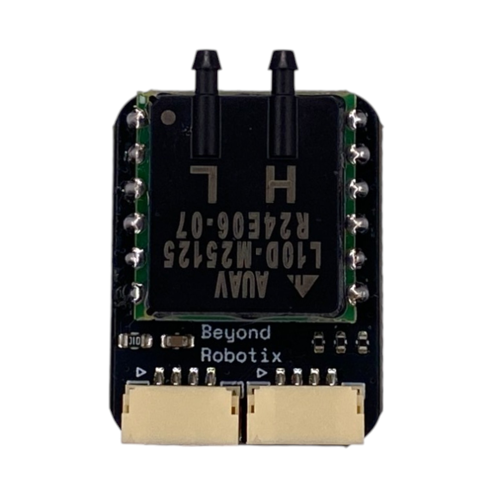

# Pinout

## Connectors

<figure><figcaption></figcaption></figure>

The Beyond Robotix Air Data Module has 2 CAN ports. They follow the standard pixhawk pinout. Pin 1 is indicated by the small white arrow.

<table><thead><tr><th width="316" align="right">Pin</th><th>Function</th><th data-hidden>Notes</th></tr></thead><tbody><tr><td align="right">1</td><td>5V</td><td>Recommended: 4.5 - 6V</td></tr><tr><td align="right">2</td><td>CAN H</td><td></td></tr><tr><td align="right">3</td><td>CAN L</td><td></td></tr><tr><td align="right">4</td><td>GND</td><td></td></tr></tbody></table>


The CAN ports are common that can be used to daisy chain to other CAN nodes.


The computation on the Air Data Module is performed on the [CAN Node](../can-node-system/micro-node.md). If you would like to terminate the CAN bus at the Air Data Module, a solder jumper labeled `120R` can be jumped.

<figure><figcaption></figcaption></figure>

