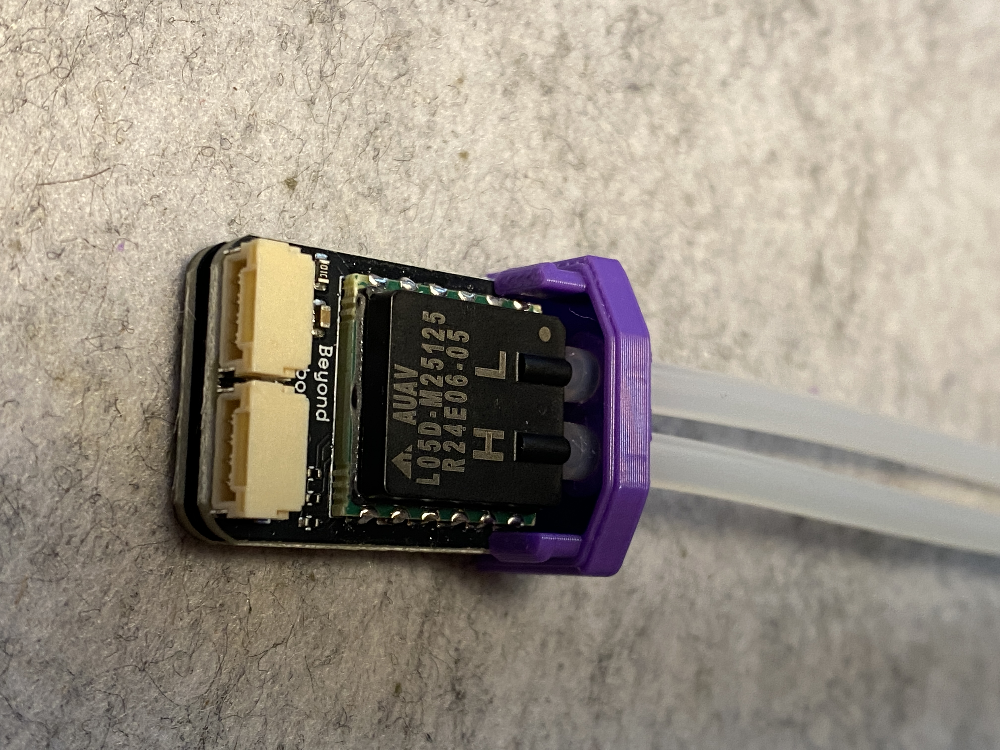
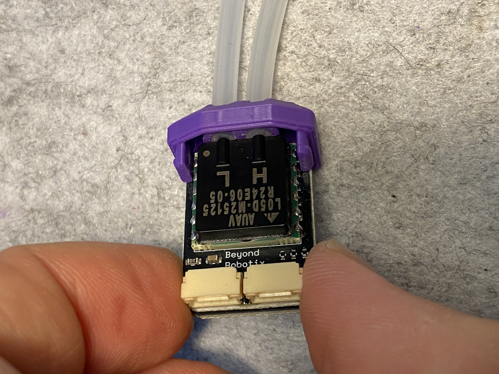
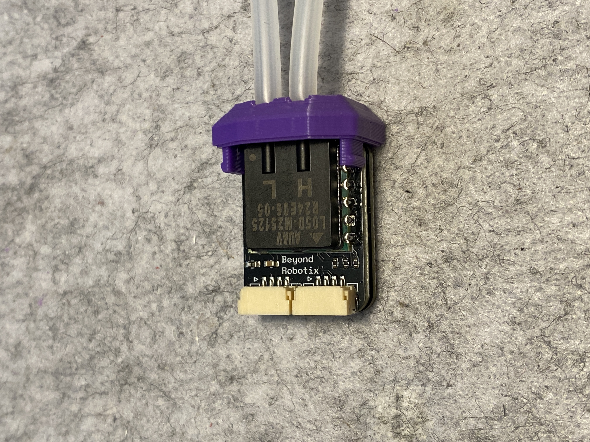
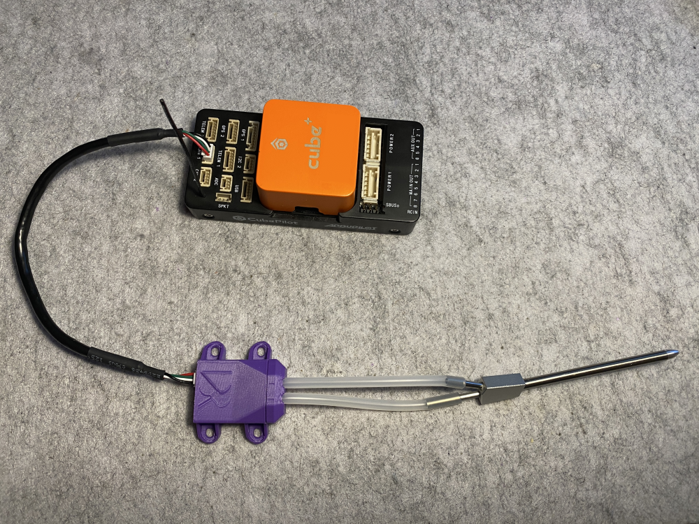
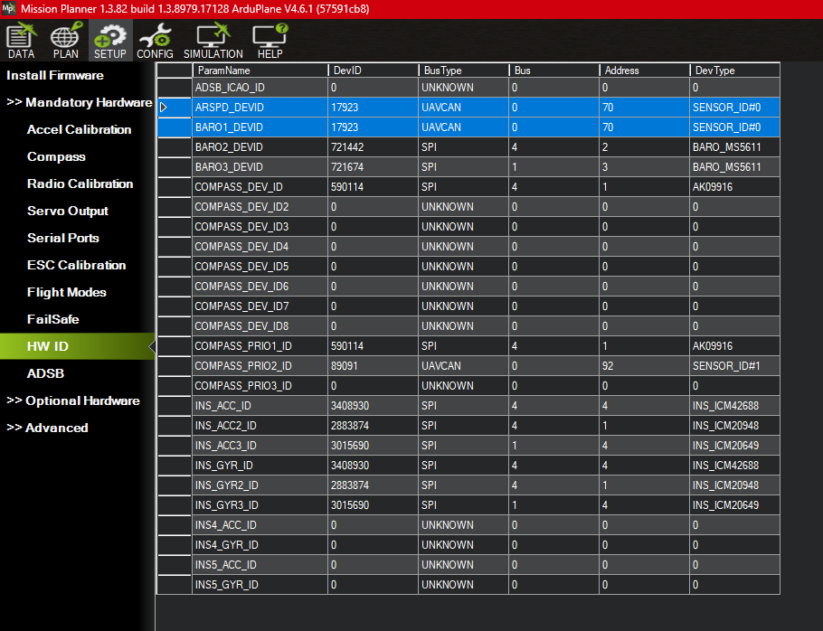

# Quick Start Guide

The Beyond Robotix Air Data Module includes the following:

* AUAV Sensor Board
* Micro CAN Node
* Pitot Static Tube
* Silicone tube
* Case

<figure><figcaption></figcaption></figure>

## Assembly

1. Feed the tube through the lid of the case until there is about 1 mm protruding through the lid.&#x20;

<figure><figcaption></figcaption></figure> <figure><figcaption></figcaption></figure>

2. Insert the AUAV sensor into the tubes and pull the tubes gently until the sensor is flush with the plastic

<figure><figcaption>
Before pulling flush
</figcaption></figure> <figure><figcaption>
After pulling flush
</figcaption></figure> <figure><figcaption>
Top View
</figcaption></figure>

3. Slide the sensor assembly into the main case and press until you feel a click

<figure><figcaption></figcaption></figure> <figure><figcaption></figcaption></figure>

4. Fix the pitot static tube to the tubes from the airspeed sensor.&#x20;

<figure><figcaption></figcaption></figure>


Ensure the **high** side (H) of the sensor is connected to the **straight** barb on the pitot-static tube (going to the total pressure port) and the **low** side (L) of the sensor to the **diagonal** barb (going to the static ports).


5. Connect to one of your CAN ports on your flight controller

<figure><figcaption></figcaption></figure>

5. Set the following parameters, if they are not already set:
   1. CAN\_D1\_PROTOCOL = 1 (DroneCAN)
   2. CAN\_P1\_DRIVER = 1 (First Driver)
   3. ARSPD\_ENABLE = 1 (ENABLE)
   4. ARSPD\_TYPE = 8 (DroneCAN)
6. Save parameters and reboot your autopilot. You should be able to see the airspeed and barometer sensor in the HW ID tab of Mission Planner.

<figure><figcaption>
Airspeed and barometer show up as UAVCAN
</figcaption></figure>

