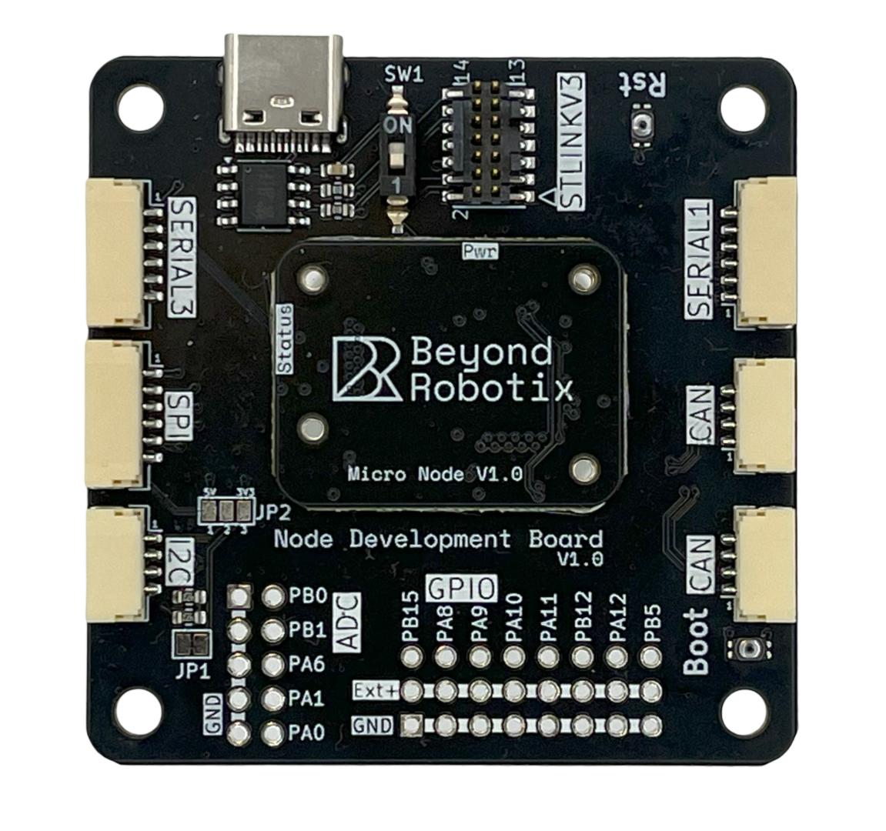

# CAN Node System

The micro CAN node system allows easy integration of a CAN node into your project! We've solved the CAN node hardware and software problems, so you can create your custom solution rapidly.

If you're interested in a custom carrier board, or have any engineering enquiries please contact us at admin@beyondrobotics.com. We can also write custom firmwares for you!

## Getting Started

If you've just received your CAN node product, we have all the hardware and software details here!

If you can't find something in the docs or have more questions, contact us at **admin@beyondrobotix.com**

### Micro Node

The Micro Node carriers the STM32L431 chip with all required hardware. It has a high density connector to interface with the Node Develpment board, or any other board that fits a Micro Node.



<figure><figcaption>
Micro Node 
</figcaption></figure>

### Node Development Board

The Node Development Board breaks out all the interfaces from the mounted node, including UART, SPI, I2C, USB, STLINK, CAN, Analogue and GPIOs.



<figure><figcaption>
Carrier board with Micro Node Mounted
</figcaption></figure>

### L431 "Plain" CAN node

The same STM32L431 as the Micro Node, but as a standalone board rather than one that mounts to a carrier. Interfaces come out on JST-GH connectors and a 2.54mm header, and it has the same debug port for developing Arduino DroneCAN applications. Pick this one when you don't need a custom carrier board.



<figure><figcaption>
L431 "Plain" CAN node
</figcaption></figure>


[l431-plain-can-node.md](l431-plain-can-node.md)


### Micro Node Plus

Our H7 node. Two fully independent CAN FD interfaces, a lot more processing power than the L431 nodes, and JST-GH connectors for serial, I2C, SPI and PWM following the same conventions as an autopilot.

<!-- TODO image: board render / photo -->


[micro-node-plus.md](micro-node-plus.md)


### Arduino DroneCAN

You can integrate your sensor how you like with minimal code and using pre-existing Arduino libraries. Includes bootloader support so your apps can be updated over CAN.

Perfect for your custom hardware solutions, or if you want to implement your own logic!


[arduino-dronecan](arduino-dronecan/)


### AP Periph

Ardupilots swiss army knife, no code required with many common sensors supported [https://ardupilot.org/dev/docs/ap-peripheral-landing-page.html](https://ardupilot.org/dev/docs/ap-peripheral-landing-page.html)

Details on our specific AP periph firmware are on the following page:


[ap-periph.md](ap-periph.md)

