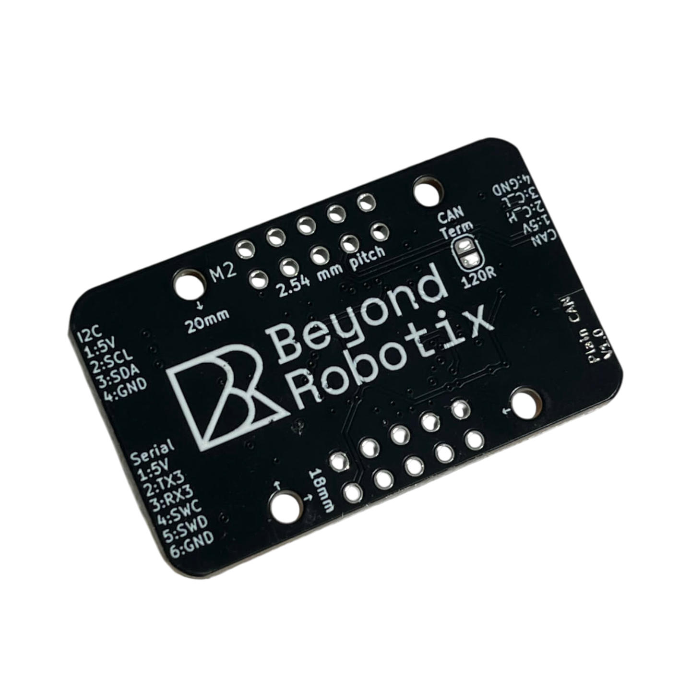

# CAN Node

## Overview

This is a standard form factor variant of our Micro Node for projects which require less customisability but still with lots of features accessible, and the handy debug port for developing Arduino DroneCAN applications.

With its mounting holes & 2.54mm header it can be integrated robustly into your projects.



* Debug interface for easy Arduino DroneCAN development (Serial+SWD)
* M2 18x20mm mounting holes
* LED indicators
* JST-GH connector interfaces
  * 1x CAN interface with two CAN connectors for daisy chaining
  * 1x Serial
  * 1x i2c
* 2.54mm pitch general breakouts including:
  * CAN (same interface as the JST-GH)
  * Additional serial
  * 5 ADCs
  * 6 PWMs
  * i2c (same interface as JST-GH)
  * 5v
  * 3.3v
* Power input dioded + fused

<div><figure><figcaption></figcaption></figure> <figure><figcaption></figcaption></figure></div>

## Specifications

| Item | Detail |
|---|---|
| MCU | STM32L431 |
| Flash | 256 KB total |
| CAN | 1x CAN1 (Classic CAN, no CAN FD) |
| Crystal | 8 MHz external oscillator |
| Dimensions | 18 x 20 mm (see [Mounting holes & Board dimensions](#mounting-holes-and-board-dimensions)) |

## Firmware

The board is primarily designed to be used with our **Arduino DroneCAN** library, so you can write your own firmware around your sensor with minimal boilerplate. It also ships with **AP\_Periph** firmware by default, ArduPilot's ready-made DroneCAN peripheral firmware, for when no custom firmware is needed.

### Arduino DroneCAN

The recommended way to build custom firmware for this board. Handles the DroneCAN plumbing for you, so integrating a new sensor is usually a small amount of code.


[arduino-dronecan](arduino-dronecan/)


### AP\_Periph (default shipped firmware)

Every board ships with a generic AP\_Periph build by default. It requires no code and supports a wide range of common sensors out of the box.

#### Default firmware features

* **Servo/PWM output** — 6 channels, see [PWM](#pwm) below
* **GPS** — moving-baseline support, Septentrio SBF driver enabled, output on Serial 3 by default
* **Airspeed (I2C)** — MS4525 sensor as default type
* **Battery monitor** — analog voltage/current sensing, disabled by default, enable via DroneCAN parameters
* **Relay output**
* **Serial ESC passthrough**

#### Servo / PWM outputs (channels 1–6)

| Pin | Timer | RCOut Channel |
|---|---|---|
| PA0 | TIM2\_CH1 | 1 |
| PA1 | TIM2\_CH2 | 2 |
| PA8 | TIM1\_CH1 | 3 |
| PA9 | TIM1\_CH2 | 4 |
| PA10 | TIM1\_CH3 | 5 |
| PA11 | TIM1\_CH4 | 6 |

Outputs 1–2 are driven by TIM2 (general-purpose timer), outputs 3–6 by TIM1 (advanced timer).

| Parameter | Purpose | Notes |
|---|---|---|
| `OUTn_FUNCTION` | Assigns output function to channel *n* (1–6) | `0` = Disabled. See `SRV_Channel::Aux_servo_function_t` for full list (e.g. Motor1, RCIN1, GPIO). |
| `OUTn_MIN` / `OUTn_MAX` | PWM endpoint range (µs) | Per channel |
| `OUTn_TRIM` | Trim/neutral PWM (µs) | Per channel |
| `OUTn_REVERSED` | Reverse output direction | Per channel |
| `ESC_RATE` | Update rate for ESC/motor outputs | Default 400 Hz |
| `ESC_PWM_TYPE` | Output protocol (OneShot/DShot/etc.) | Default 0 (normal PWM) |

Relay/GPIO output can reuse these same pins (GPIO 50–55) when the corresponding `OUTn_FUNCTION` is set to `-1`/GPIO instead of a servo function.

#### Battery monitor

| Parameter | Purpose | Default |
|---|---|---|
| `BATT_MONITOR` | Monitor type (`0`=Disabled, `4`=Analog Voltage+Current, etc.) | `0` (disabled) |
| `BATT_VOLT_PIN` | ADC pin for voltage sense | `5` (maps to PB0) |
| `BATT_VOLT_MULT` | Voltage divider scale | `21.0` |
| `BATT_CURR_PIN` | ADC pin for current sense | `6` (maps to PB1) |
| `BATT_AMP_PERVLT` | Current sensor scale (A/V) | `40.0` |

Set `BATT_MONITOR` to a nonzero type to enable; the pin/scale defaults above already match the onboard sense resistors/divider, but can be overridden per-install if a different sensor is wired.

#### Airspeed (I2C)

| Parameter | Purpose | Default |
|---|---|---|
| `ARSPD_TYPE` | Sensor type | `1` = MS4525 |
| `ARSPD_BUS` | I2C bus index | Auto-detected on the onboard I2C bus |

#### GPS

| Parameter | Purpose | Default |
|---|---|---|
| `GPS1_TYPE` | GPS protocol/type | Auto-detect on Serial 3 |
| `GPS_PORT` | DroneCAN GPS output port index | `2` |
| `GPS_MB_ONLY_PORT` | Restrict moving-baseline pairing to a specific CAN port | `0` (disabled) |

Moving-baseline and Septentrio SBF support are compiled in; no extra param is needed to enable the driver itself, only to select the correct `GPS1_TYPE`.

#### Firmware files and flashing

If there is no AP\_Periph bootloader present on the node (you've been using Arduino DroneCAN, for example) then the `with bootloader` .hex needs flashing with STM32CubeProgrammer using STLINK or UART.

If the AP\_Periph bootloader is already present, the .bin file can be used in the usual way through Mission Planner.





For general background on AP\_Periph on our nodes, see:


[ap-periph.md](ap-periph.md)


## Mechanical

### CAD

Full CAD including connectors can be found here:



### Mounting holes & Board dimensions

Mounting holes are M2 (2.2mm diameter cutout)

Dimensions in mm:

<figure><figcaption></figcaption></figure>

## Pinout / Interfaces

### CAN

The CAN Node has 1 available CAN interface, which is pinned out to 2 JST-GH CAN ports, to allow CAN device chaining.

| Pin Number | Description |
| ---------- | ----------- |
| 1          | Vcc (5V)    |
| 2          | CANH        |
| 3          | CANL        |
| 4          | GND         |

### I2C

The CAN Node has 1 available I2C interface exposed to a JST-GH port.


The CAN Node V1.0 has no i2c pullups on board. I2C sensors attached to this interface will need pullups to function.



| Pin | Description |
| --- | ----------- |
| 1   | 5V          |
| 2   | SCL         |
| 3   | SDA         |
| 4   | GND         |

### Serial

The CAN node has 3 serial interface exposed. UART1 is exposed on the 2.54mm header pins, UART2 is exposed in the ST-LINK Debug header and UART3 is exposed on the JST-GH.


| Pin | Description |
| --- | ----------- |
| 1   | Vcc (5V)    |
| 2   | UART3\_TX   |
| 3   | UART3\_RX   |
| 4   | N/C         |
| 5   | N/C         |
| 6   | GND         |

## 2.54mm Header

More interfaces can be accessed through the 2.54mm header. Wires could be directly soldered to these pads, or header pins could be added.

The CAN interface is accessible through this header, as well as power input, allowing the board to be used purely through the header without needing the JST-GH connectors if desired.

Apart from general GPIO described after the image the following is available:

* 1x CAN interface (C\_L, C\_H)
* 3v3
* 5V
* 2x GND pads
* TX1/RX1
* I2C interface (same pins as the JST-GH)
* 9x GPIO/ADC/PWM

<figure><figcaption></figcaption></figure>

### PWM

PWMs:

* A0 — `OUT1` in AP\_Periph
* A1 — `OUT2` in AP\_Periph
* A8 — `OUT3` in AP\_Periph
* A9 — `OUT4` in AP\_Periph
* A10 — `OUT5` in AP\_Periph
* A11 — `OUT6` in AP\_Periph


When using Arduino DroneCAN, these pins can be accessed in your program using `PA_8` in your code for A8



When using AP\_Periph, these channels are configured with the `OUTn_FUNCTION`, `OUTn_MIN`/`OUTn_MAX`, `OUTn_TRIM` and `OUTn_REVERSED` parameters — see [Servo / PWM outputs](#servo--pwm-outputs-channels-1-6) above.


### ADC

* A0 — ADC pin `5`
* A1 — ADC pin `6`
* A4 — ADC pin `9`
* B0 — ADC pin `15`
* B1 — ADC pin `16`


In AP\_Periph, A0 (pin `5`) and A1 (pin `6`) are the default `BATT_VOLT_PIN`/`BATT_CURR_PIN` for [Battery monitor](#battery-monitor) above.


These pins can be read in Arduino DroneCAN like:

```cpp
analogRead(PA0);
```


The maximum voltage of the ADC pins is 3.3V.


## Programming the board

### ST-Link

STM32 allows the ability to easily debug programs over SWDIO. This allows live variable inspection, breakpoints and more - which makes program development much easier!

The "STLINKV3" header is directly compatible with the [STLINK-V3MINIE](https://www.st.com/en/development-tools/stlink-v3minie.html). To upload code to the CAN Node, simply:

1. Connect the node to the STLINKV3
2. Click upload or debug in VS-Code!

The pins on the ST-LINK header could also be used with normal Arduino jumpers so a STLINKV2, or another SWD based debugger could be used. The pins are as follows:

<figure><figcaption><p>STLINK Header</p></figcaption></figure>

<table><thead><tr><th width="246">Pin Number</th><th>Description</th></tr></thead><tbody><tr><td>1</td><td><mark style="color:orange;">NC</mark></td></tr><tr><td>2</td><td><mark style="color:orange;">NC</mark></td></tr><tr><td>3</td><td>5V in</td></tr><tr><td>4</td><td>SWD</td></tr><tr><td>5</td><td><mark style="color:blue;">GND</mark></td></tr><tr><td>6</td><td>SWC</td></tr><tr><td>7</td><td><mark style="color:blue;">GND</mark></td></tr><tr><td>8</td><td><mark style="color:orange;">NC</mark></td></tr><tr><td>9</td><td><mark style="color:orange;">NC</mark></td></tr><tr><td>10</td><td><mark style="color:blue;">GND</mark></td></tr><tr><td>11</td><td><mark style="color:orange;">NC</mark></td></tr><tr><td>12</td><td><mark style="color:orange;">NC</mark></td></tr><tr><td>13</td><td>UART2_TX</td></tr><tr><td>14</td><td>UART2_RX</td></tr></tbody></table>
