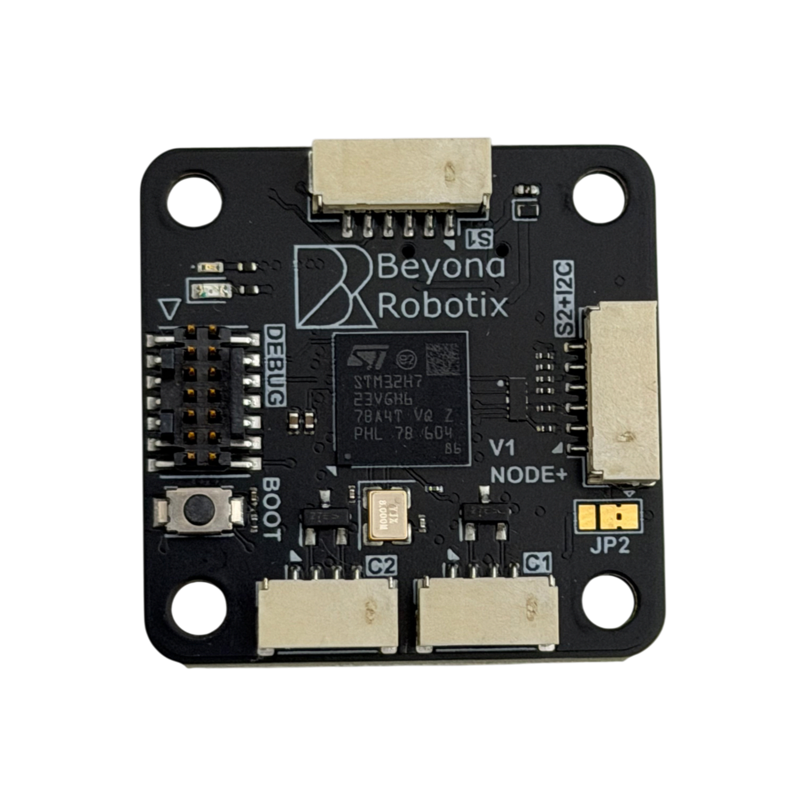
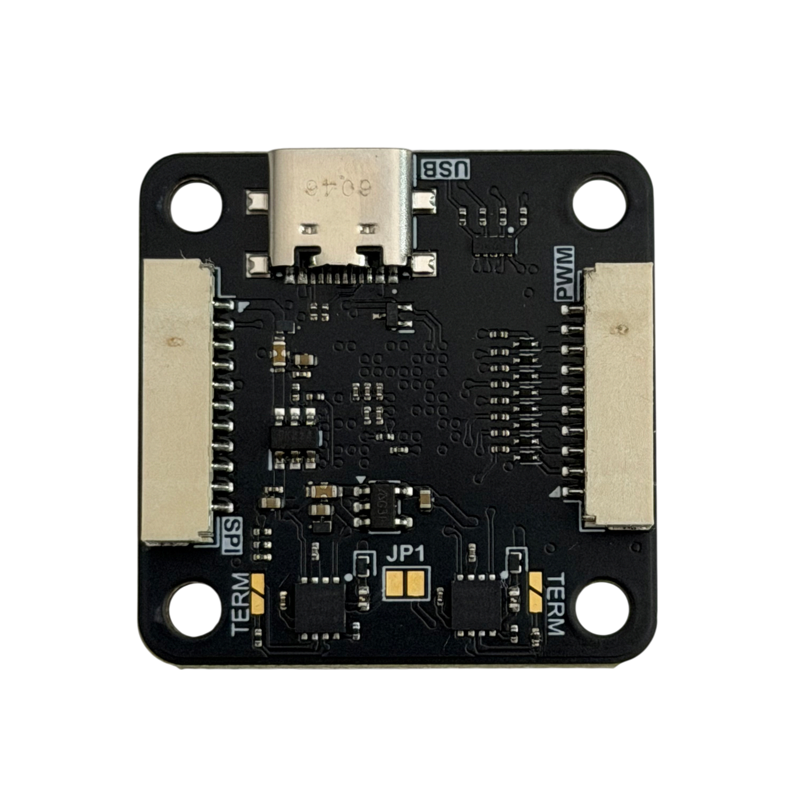
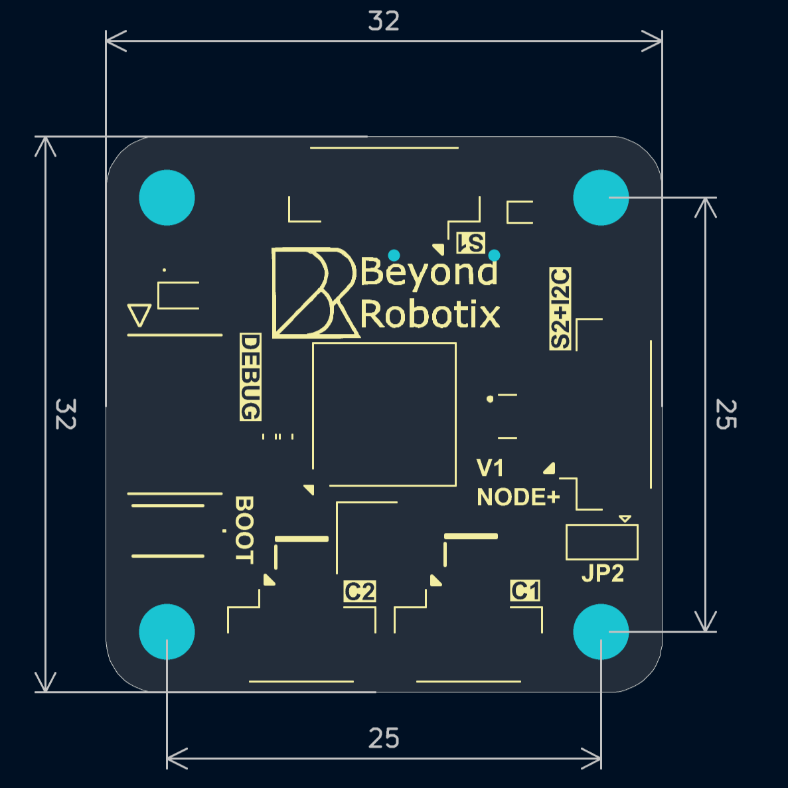

# Micro Node Plus


This page is a work in progress. The store link and a close up of the debug header are still to be added, and a few details are marked as needing confirmation.


## Overview

The Micro Node Plus steps up from our L431 nodes to an STM32H723. It brings two fully independent CAN FD interfaces, considerably more processing power, and a set of JST-GH connectors following the same conventions as an autopilot, so standard peripherals plug straight in.

Like the rest of the range it runs [Arduino DroneCAN](arduino-dronecan/), so you write a normal Arduino sketch and get DroneCAN, parameters and firmware update over CAN for free.

<figure><figcaption></figcaption></figure>


**PLACEHOLDER - link needed:** store page embed, once the product is listed.


* STM32H723VGHx processor - 550 MHz Cortex-M7, 1 MB flash
* **2x independent CAN FD interfaces**, each with its own transceiver and its own JST-GH connector
* Optional 120 ohm termination on each CAN interface, via a solder jumper
* USB-C
* SWD + serial debug header for easy Arduino DroneCAN development
* JST-GH connector interfaces
  * 2x CAN
  * 1x Serial with flow control
  * 1x Serial + I2C combined, in the same pinout an autopilot uses for GPS
  * 1x SPI, with two chip selects and two data ready lines
  * 1x PWM, 8 channels
* On-board I2C pull-up resistors
* 5V peripheral rail is current limited, and can be switched off in software
* Input voltage monitoring
* BOOT0 button
* Power input from either CAN connector or from USB, each individually fused
* 32 x 32mm, with 4x M3 mounting holes on a 25 x 25mm square

<figure><figcaption>
Top - the two CAN connectors (<code>C1</code>, <code>C2</code>), Serial 1 (<code>S1</code>), Serial 2 + I2C (<code>S2+I2C</code>), the debug header and the BOOT button
</figcaption></figure> <figure><figcaption>
Bottom - USB-C, SPI, PWM, the <code>JP1</code> power bridge and the two <code>TERM</code> termination jumpers
</figcaption></figure>

## Mechanical

### CAD

Full CAD including connectors can be found here:



### Mounting holes & Board dimensions

The board is 32 x 32mm, with the four mounting holes on a 25 x 25mm square. Mounting holes are M3 (3.2mm diameter cutout).

Dimensions in mm:

<figure><figcaption></figcaption></figure>

## Power

The board can be powered from either CAN connector or from USB. All three inputs are reverse protected and separately fused at 1 A, and are diode OR'd together, so you can safely have more than one connected at once.

The 5V supplied to the peripheral connectors (Serial, SPI and PWM) comes through a current limited load switch, which the processor can turn on and off. A short on a peripheral therefore doesn't take the node itself down.


The two CAN connectors have their own fuses, so by default 5V does **not** pass between them - a peripheral plugged into one won't be fed from the other. `JP1`, on the underside between the two CAN transceivers, bridges them if you want to daisy chain power through the node.


## Pinout / Interfaces

### CAN

Two entirely separate CAN FD interfaces, each with its own transceiver and connector. They are not two connectors on one bus - see [two CAN ports](arduino-dronecan/#two-can-ports) for how to use both from one program.

Both connectors are on the bottom edge of the top side, marked `C1` and `C2`, and share the same pinout:

| Pin | Description |
| --- | ----------- |
| 1   | Vcc (5V)    |
| 2   | CANH        |
| 3   | CANL        |
| 4   | GND         |

Each interface has its own 120 ohm termination resistor, fitted by bridging a solder jumper. The jumpers are on the underside of the board, one beside each CAN transceiver, both marked `TERM`. Both are open by default, so terminate only the nodes at the two ends of your bus.

### Serial 1

Serial with flow control, in the same pinout an autopilot uses for telemetry. Marked `S1` on the board, and available in your code as `Serial1`.

| Pin | Description | Processor pin |
| --- | ----------- | ------------- |
| 1   | Vcc (5V)    |               |
| 2   | TX          | PD5           |
| 3   | RX          | PD6           |
| 4   | CTS         | PD3           |
| 5   | RTS         | PD4           |
| 6   | GND         |               |

### Serial 2 & I2C

Serial and I2C brought out on one connector, in the same pinout an autopilot uses for GPS - so a GPS + compass module plugs straight in. Marked `S2+I2C` on the board, and available in your code as `Serial2` and `Wire`.

| Pin | Description | Processor pin |
| --- | ----------- | ------------- |
| 1   | Vcc         |               |
| 2   | TX          | PC10          |
| 3   | RX          | PC11          |
| 4   | SCL         | PB10          |
| 5   | SDA         | PB11          |
| 6   | GND         |               |

I2C pull-up resistors are fitted on the board, so I2C sensors work without adding your own.


Pin 1 of this connector is 5V by default. `JP2`, on the top side just below the connector, switches it to 3.3V if your peripheral needs that instead.


### SPI

Two chip selects, two data ready inputs, plus sync and reset lines. On the underside of the board, and available in your code as `SPI`, with the control lines as named pins.

| Pin | Description | Processor pin | In your code |
| --- | ----------- | ------------- | ------------ |
| 1   | Vcc (5V)    |               |              |
| 2   | SCK         | PE2           | `SPI`        |
| 3   | MISO        | PE5           | `SPI`        |
| 4   | MOSI        | PE6           | `SPI`        |
| 5   | CS1         | PD15          | `SPI_CS1`    |
| 6   | CS2         | PD14          | `SPI_CS2`    |
| 7   | SYNC        | PD13          | `SPI_SYNC`   |
| 8   | DRDY1       | PD12          | `SPI_DRDY1`  |
| 9   | DRDY2       | PD11          | `SPI_DRDY2`  |
| 10  | nRESET      | PD10          | `SPI_nRESET` |
| 11  | GND         |               |              |

The chip select, data ready, sync and reset lines are plain GPIO - drive or read them yourself, for example `digitalWrite(SPI_CS1, LOW)`.

### PWM

8 PWM channels on one connector, on the underside of the board opposite the SPI connector.

| Pin | Description | Processor pin | In your code |
| --- | ----------- | ------------- | ------------ |
| 1   | Vcc (5V)    |               |              |
| 2   | PWM 1       | PA3           | `PWM1`       |
| 3   | PWM 2       | PA2           | `PWM2`       |
| 4   | PWM 3       | PA1           | `PWM3`       |
| 5   | PWM 4       | PE13          | `PWM4`       |
| 6   | PWM 5       | PA9           | `PWM5`       |
| 7   | PWM 6       | PA8           | `PWM6`       |
| 8   | PWM 7       | PC7           | `PWM7`       |
| 9   | PWM 8       | PC6           | `PWM8`       |
| 10  | GND         |               |              |


Use the names rather than the processor pins in your code - `analogWrite(PWM1, value)` - and the numbering follows the connector.


## Programming the board

### ST-LINK

STM32 allows the ability to easily debug programs over SWDIO. This allows live variable inspection, breakpoints and more - which makes program development much easier!

The debug header carries SWD, reset, and a serial console which appears in your code as `Serial`. To upload code:

1. Connect the node to your ST-LINK
2. Click upload or debug in VS-Code!


**PLACEHOLDER - image needed:** close up of the debug header with pin 1 marked, as on the Plain node page. The header itself is visible in the top side photo above, to the left of the processor, marked `DEBUG`.


| Pin | Description |
| --- | ----------- |
| 1   | NC          |
| 2   | NC          |
| 3   | 3.3V        |
| 4   | SWD         |
| 5   | GND         |
| 6   | SWC         |
| 7   | GND         |
| 8   | NC          |
| 9   | NC          |
| 10  | NC          |
| 11  | GND         |
| 12  | NRST        |
| 13  | Debug UART RX (into the node) |
| 14  | Debug UART TX (out of the node) |


Pin 3 is **3.3V**, not 5V as on the Micro Node debug header - this header will not power the board. Power the node over CAN or USB while debugging.


### DFU

There is a BOOT0 button on the board. Holding it while resetting the node starts the processor's built in bootloader, which can be used to recover a board over USB if the bootloader is ever lost.

## Using it with Arduino DroneCAN

Build for the Micro Node Plus by selecting the `Micro-Node-Plus-App` environment in PlatformIO. Everything else works the same as on the rest of the range, with two additions this board is capable of: CAN FD, and running both CAN interfaces at once.


[arduino-dronecan](arduino-dronecan/)

