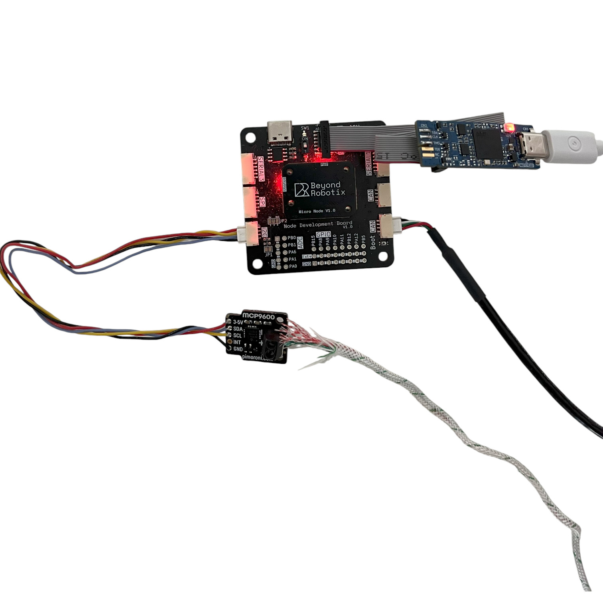
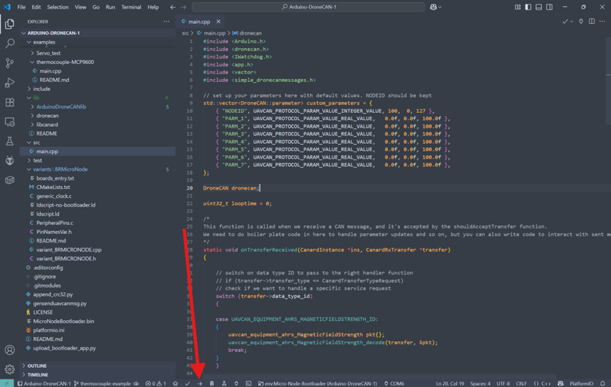
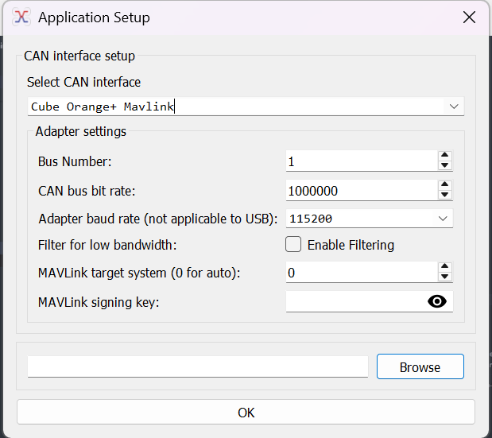
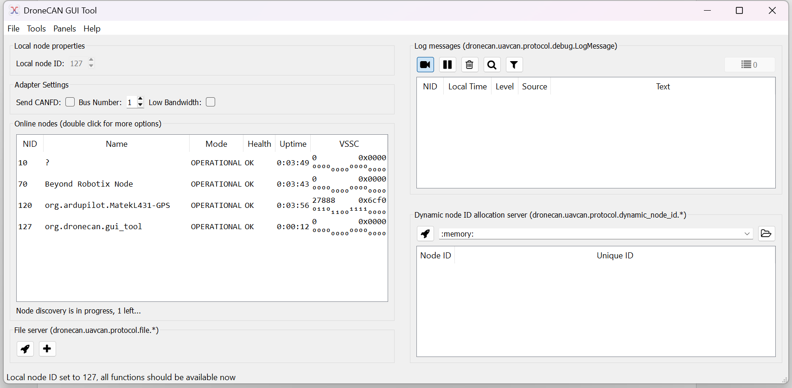
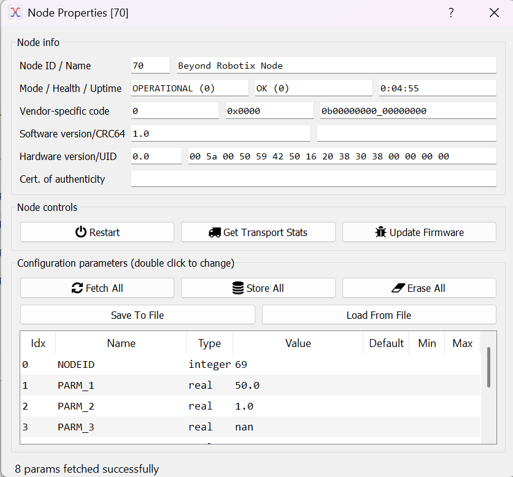
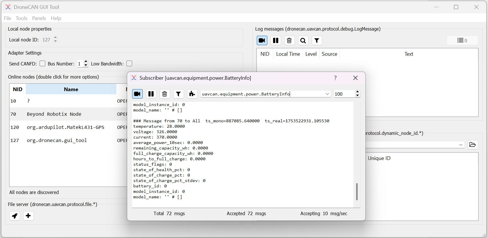
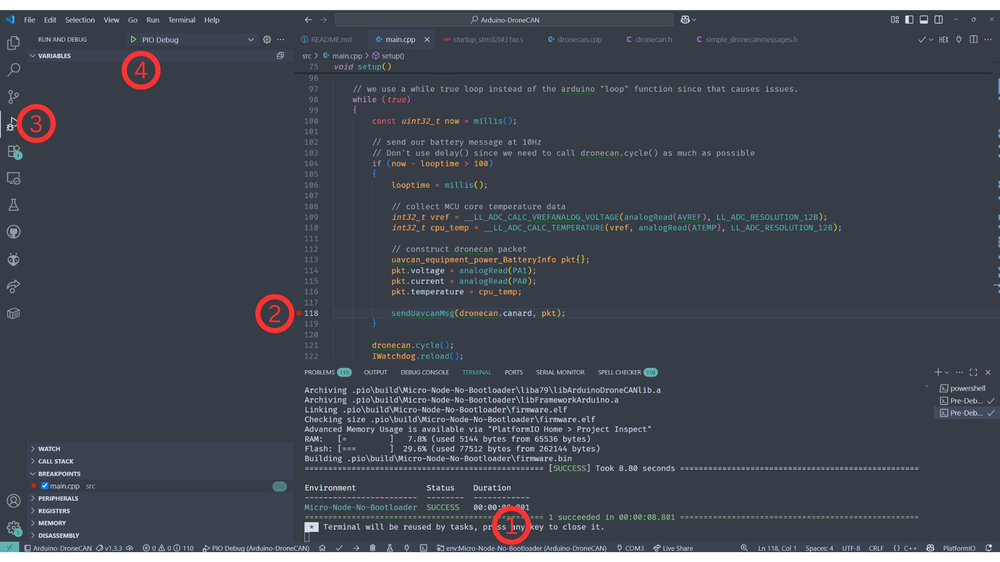

# Thermocouple Tutorial

## Intro

Do you want to integrate a sensor into Ardupilot or PX4? Arduino DroneCAN and the Beyond Robotix CAN node let you do that very quickly. This tutorial runs through integrating the Adafruit MCP9600 thermocouple sensor, resulting in us being able to send temperature messages over DroneCAN. The big advantage of using the Arduino framework is access to Arduino libraries. Almost always, there are libraries available for the sensor you want to use. This saves development time. The Arduino framework is also simple to work with, and the Platformio + VS code platform allows easy development from small to complicated projects.

<figure><figcaption></figcaption></figure>

Using custom firmware allows lots of options, such as integrating a battery monitor + thermocouple and sending all the information with one device in one message. You could action tasks based on the thermocouple onboard the node, e.g. opening a hatch if the battery is getting too hot.

You could integrate GPS receivers, new airspeed sensors, fuel sensors, gas sensors, ESCs and servo nodes.

## Hardware Requirements

* Beyond Robotix CAN Node Dev Kit



* Flight controller with a CAN bus (Or a CAN 'Sniffer')
* Windows PC is assumed - but other OS’s will apply there might just be some minor adjustments needed
* [Adafruit MCP9600](https://www.adafruit.com/product/4101) + [Thermocouple](https://www.adafruit.com/product/270)


## Getting started

To start, we should download the latest release of Arduino DroneCAN from:



The code we will run through is in examples/thermocouple-mcp9600 which is here:



We’ll need to download a few things to work with the software. We’ve got these setup instructions on our documentation site here:



We’ll also need to get our hardware setup. You’ll need a DroneCAN compatible flight controller or sniffer. We’ll use a Cube Orange. Then connect your Beyond Robotix CAN node to the flight controller via a CAN cable. Also, connect your STLINK to the debug port on the CAN node. Lastly, ensure the switch next to the debug port (`SW1`) is set to '1'.

<figure><figcaption></figcaption></figure>

With the repository downloaded and our tools installed, we can build the default example to make sure it’s all working correctly. The default example sends a "BatteryInfo" message which we'll see later.

<figure><figcaption></figcaption></figure>

You should then see “SUCCESS” shown in the terminal. If you don’t, make sure your STLINK is connected correctly and power is being given to the CAN node via the flight controller.&#x20;

<figure><figcaption></figcaption></figure>

We can now see what CAN messages are being sent by the Node. We’ll use DroneCAN GUI tool in this example, however, Mission Planner can also be used for CAN packet inspection.&#x20;



<figure><figcaption></figcaption></figure>

Once connected, we’ll see our Node showing in the list, (you may need to set the Local node ID, press the tick in the top left ish)

<figure><figcaption></figcaption></figure>

We can see the example parameters in Node properties:

<figure><figcaption></figcaption></figure>

And we can also see the battery message being sent (which can be found in Tools > Subscriber)

<figure><figcaption></figcaption></figure>

We can see the temperature field which responds to the built in MCU temperature sensor. “Voltage” and “current” are showing the raw ADC values from PA1 and PA0 respectively.


## Getting MCP9600 data

We’ve chosen to use the Adafruit library, although there are a few MCP9600 libraries to choose from. Download the latest release, unzip and add it to the “lib” folder of your project. Make sure there are no nested folders! The library can also be installed from the platformio library manager. The “BusIO” library is also needed. Platformio may install this for you.






Let's have a look at their example...



They import the files, set the i2c address and setup the `mcp` object. We had to set the address to 0x66 for the MCP9600 we had.

```cpp
#include <Wire.h>
#include <Adafruit_I2CDevice.h>
#include <Adafruit_I2CRegister.h>
#include "Adafruit_MCP9600.h"

#define I2C_ADDRESS (0x67)

Adafruit_MCP9600 mcp;
```

We then call `.begin` method

```cpp
 /* Initialise the driver with I2C_ADDRESS and the default I2C bus. */
if (! mcp.begin(I2C_ADDRESS)) {
  Serial.println("Sensor not found. Check wiring!");
  while (1);
}
```

then, they have a bunch of other options but the two we're interested in for the basics:

```cpp
 // set our thermocouple type
 mcp.setThermocoupleType(MCP9600_TYPE_K);
 
 // take a temperature measurement
 mcp.readThermocouple()
```

So, with this information, we can now write our DroneCAN application.

## Writing our app

Now, we go to `main.cpp` in Arduino DroneCAN and add the code from above to our  `setup()` function. We have provided an example for you to follow:



In many arduino projects, you might use `delay()`. This can cause problems with Arduino DroneCAN as to needs to perform functions in the background. So, instead of using `delay()`, setup a statement that only runs once a timer counts to a given time, in this example 1000ms. When not meeting this condition, it always calls "dronecan.cycle()" which processes CAN frames in the background and "IWatchdog.reload()" which ensures our watchdog doesn't reset.

In this example, when we are unable to connect to the MCP9600, we want to keep resending the message every second over CAN and serial to say we have a problem. Instead of using a delay, we use an `if` statement which waits until a time has elapsed while still allowing the background tasks to run.

```cpp
if (!mcp.begin(I2C_ADDRESS))
{
    // used to keep track of the time the last debug statement was run 
    uint32_t deadloop = 0;
    
    while (1)
    {
        // see what our current time is
        const uint32_t now = millis();
        
        // check if enough time has passed to activate our debug statements
        if (now - deadloop > 1000)
        {
            // refresh the timer, so the next one will trigger in 1000ms
            deadloop = millis();
            
            dronecan.debug("MCP9600 not found", 0);
            Serial.println("Sensor not found. Check wiring!");
        }
        
        // cycle through recieve and transmit CAN messages
        dronecan.cycle();
        // reset Watchdog to make sure the watchdog doesn't reset us
        IWatchdog.reload();
    }
}
```

Another point is we don't use the `void loop()` that Arduino uses normally. Instead we have a `while(true){` running at the end of the `void setup()` function.

```cpp
void setup()
{
    # Set up Code
    
    while(true){
        # Looping Code
        
    }  
}  
```

Now, in the example, we've written in some logic which lets you send either a temperature packet or a battery packet depending on some parameters. At the core of it, we send a DroneCAN message like this:

```cpp
uavcan_equipment_device_Temperature pkt{};

pkt.temperature = mcp.readThermocouple();
pkt.device_id = device_id;

sendUavcanMsg(dronecan.canard, pkt);
```

We can see that we read in our thermocouple measurement, and put it into a Temperature packet. You can see the packets available here:



Although there are lots of different types of packets, not all are actually understood by PX4 or Ardupilot, so you'll have to do some research on the appropriate packet to use. If you get stuck you can contact us at **admin@beyondrobotix.com**

We also set the device\_id, which we pull from a parameter in a different part of the loop. This is used by Ardupilot to identify which battery instance to put the temperature into.

We then do our "sendUavcanMsg" which queues our packet.&#x20;

And there we go! If you compile our example, you'll see either battery or temperature packets coming through depending on the parameters set.

We can create fairly complex features easily : - ) If you use the library and/or CAN node in your project, we'd be keen to hear about it! contact us at **admin@beyondrobotix.com**


## Breakpoint debugging

We can debug our programs easily with an STLINK. This is included in the Micro CAN node dev kit. Breakpoint debugging is very useful, being able to see the value of variables in real time as the program runs.&#x20;

1. Select the build environment to be "Micro-Node-No-Bootloader" building with the default environment will result in the program going into maintenance mode and staying in the bootloader
2. Set a breakpoint where you're interested in seeing the program state
3. Change to the Debug VS code tab
4. Start the debug session

<figure><figcaption></figcaption></figure>

After the program rebuilds, and starts running, the program now stops at where we set our breakpoint. We can see all the in scope variables on the left, and you can even hover over variables in the code to see their value.&#x20;

<figure><figcaption></figcaption></figure>

Remember, our CAN node now doesn't have a bootloader active, you won't be able to upload firmware over CAN. Once you've done your development and debugging, switch back to the bootloader environment and you'll be good to go.


## Folder structure

By default, we have a bunch of folders and files in our project.

* .mypy\_cache -> transient, will be generated once you start interacting with the code. Won't be tracked by git
* .pio -> transient, contains all the build files. We can grab our .bin file from here if we want to distribute the program
* .vscode -> vscode config files
* assets -> Just used for our repository for logos etc
* boards -> contains files which tell Platformio about the board we are using, referenced in "platformio.ini"
* dronecan -> this one contains all the files needed to generate UAVCAN/DroneCAN message headers. Unless you want to regenerate these or do your own messages, we don't need this.
* examples -> contains all the code examples that will hopefully help you on how to use the library. Each example contents can be copied to "src/main.cpp" to run them. Bear in mind you may need additional library configuration to run them. This should be in the README of each example folder.
* include -> there's a README in there explaining how to use it
* lib -> any arduino libraries you want to manually download and unzip go here. This also contains the core "Arduino DroneCAN lib" files, which can be modified if you want to extend the library functionality. We're open to PRs : ) Also contains DroneCAN message headers and libcanard which does our low level CAN frame management
* src/main.cpp -> Our core program!
* test -> See the README in this folder to see how to use it
* variants -> contains code on board configuration. specifies what pins can be used and how. Also specifies RAM/Flash configurations specific to the board MCU
* MicroNodeBootloader.bin -> our bootloader binary. "upload\_bootloader\_app.py" uses this file and uploads this and the main program at the same time
* platformio.ini -> specifies how platformio interacts with the project

<figure><figcaption></figcaption></figure>

