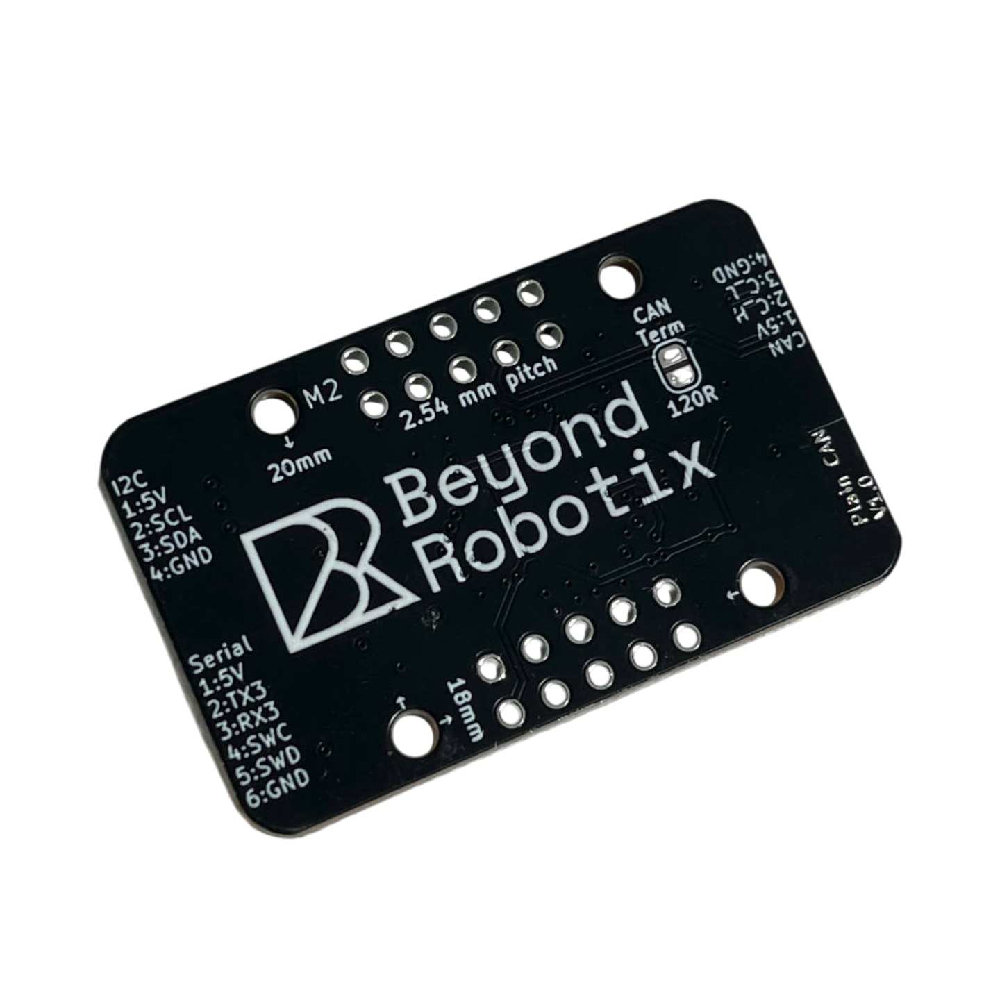

# L431 "Plain" CAN node

## Overview

This is a standard formfactor varient of our Micro CAN node for projects which require less customisability but still with lots of features accessible and the handy debug port for developing Arduino DroneCAN applications!&#x20;

With it's mounting holes & 2.54mm header it can be integrated robustly into your projects.




* Debug interface for easy Arduino DroneCAN development (Serial+SWD)
* M2 18x20mm mounting holes
* LED indicators
* JST-GH connector interfaces
  * 1x CAN interface with two CAN connectors for daisy chaining
  * 1x Serial
  * 1x i2c
* 2.54mm pitch general breakouts including:
  * CAN (same interface as the JST-GH)
  * Additional serial
  * 5 ADCs
  * 5 PWMs
  * i2c (same interface as JST-GH)
  * 5v
  * 3.3v
* Power input dioded + fused

<div><figure><figcaption></figcaption></figure> <figure><figcaption></figcaption></figure></div>


## Mechanical

### CAD

Full CAD including connectors can be found here:




### Mounting holes & Board dimensions

Mounting holes are M2 (2.2mm diameter cutout)

Dimensions in mm:

<figure><figcaption></figcaption></figure>


## Pinout / Interfaces

### CAN

The Micro Node has 1 available CAN interface, which is pinned out to 2 JST-GH CAN ports, to allow CAN device chaining.&#x20;

| Pin Number | Description |
| ---------- | ----------- |
| 1          | Vcc (5V)    |
| 2          | CANH        |
| 3          | CANL        |
| 4          | GND         |

### I2C

The Plain Node has 1 available I2C interface exposed to a JST-GH port.&#x20;


The plain Node V1.0 has no i2c pullups on board. I2C sensors attached to this interface will need pullups to function.


| Pin | Description |
| --- | ----------- |
| 1   | 5V          |
| 2   | SCL         |
| 3   | SDA         |
| 4   | GND         |

### Serial

The Plain CAN node has 1 serial interface exposed as a JST-GH. Another interface is availible through the debug port and one other through the 2.54mm header pins.

#### Serial 3

| Pin | Description |
| --- | ----------- |
| 1   | Vcc (5V)    |
| 2   | UART3\_TX   |
| 3   | UART3\_RX   |
| 4   | N/C         |
| 5   | N/C         |
| 6   | GND         |

## 2.54mm Header

More interfaces can be accessed through the 2.54mm header. Wires could be directly soldered to these pads, or header pins could be added.&#x20;

The CAN interface is accessible through this header, as well as power input, allowing the board to be purely used through the header without needing the JST-GH connectors if desired.

Apart from general GPIO described after the image the following is availible:

* 1 CAN interface (C\_L, C\_H)
* 3v3
* 5V
* 3x GND pads
* TX1/RX1
* I2C interface (same pins as the JST-GH)

<figure><figcaption></figcaption></figure>

### PWM

PWMs:

* A0
* A1
* A8
* A10
* A11


When using Arduino DroneCAN, these pins can be accessed in your program using `PA_8` in your code for A8


### ADC

* A0
* A1
* B0
* B1
* A4

These pins can be read in ArduinoDroneCAN like:

```cpp
analogRead(PA0);
```


The maximum voltage of the ADC pins is 3.3V.


## Programming the board

### ST-LINK

STM32 allows the ability to easily debug programs over SWDIO. This allows live variable inspection, breakpoints and more - which makes program development much easier!

The "STLINKV3" header is directly compatible with the [STLINK-V3MINIE](https://www.st.com/en/development-tools/stlink-v3minie.html). To upload code to the Micro node, simply:

1. Connect the node to the STLINKV3
2. Click upload or debug in VS-Code!

The pins on the ST-LINK header could also be used with normal Arduino jumpers so a STLINKV2, or another SWD based debugger could be used. The pins are as follows:

<figure><figcaption><p>STLINK Header</p></figcaption></figure>

<table><thead><tr><th width="246">Pin Number</th><th>Description</th></tr></thead><tbody><tr><td>1</td><td><mark style="color:orange;">NC</mark></td></tr><tr><td>2</td><td><mark style="color:orange;">NC</mark></td></tr><tr><td>3</td><td>5V in</td></tr><tr><td>4</td><td>SWD</td></tr><tr><td>5</td><td><mark style="color:blue;">GND</mark></td></tr><tr><td>6</td><td>SWC</td></tr><tr><td>7</td><td><mark style="color:blue;">GND</mark></td></tr><tr><td>8</td><td><mark style="color:orange;">NC</mark></td></tr><tr><td>9</td><td><mark style="color:orange;">NC</mark></td></tr><tr><td>10</td><td><mark style="color:blue;">GND</mark></td></tr><tr><td>11</td><td><mark style="color:orange;">NC</mark></td></tr><tr><td>12</td><td><mark style="color:orange;">NC</mark></td></tr><tr><td>13</td><td>UART2_TX</td></tr><tr><td>14</td><td>UART2_RX</td></tr></tbody></table>
