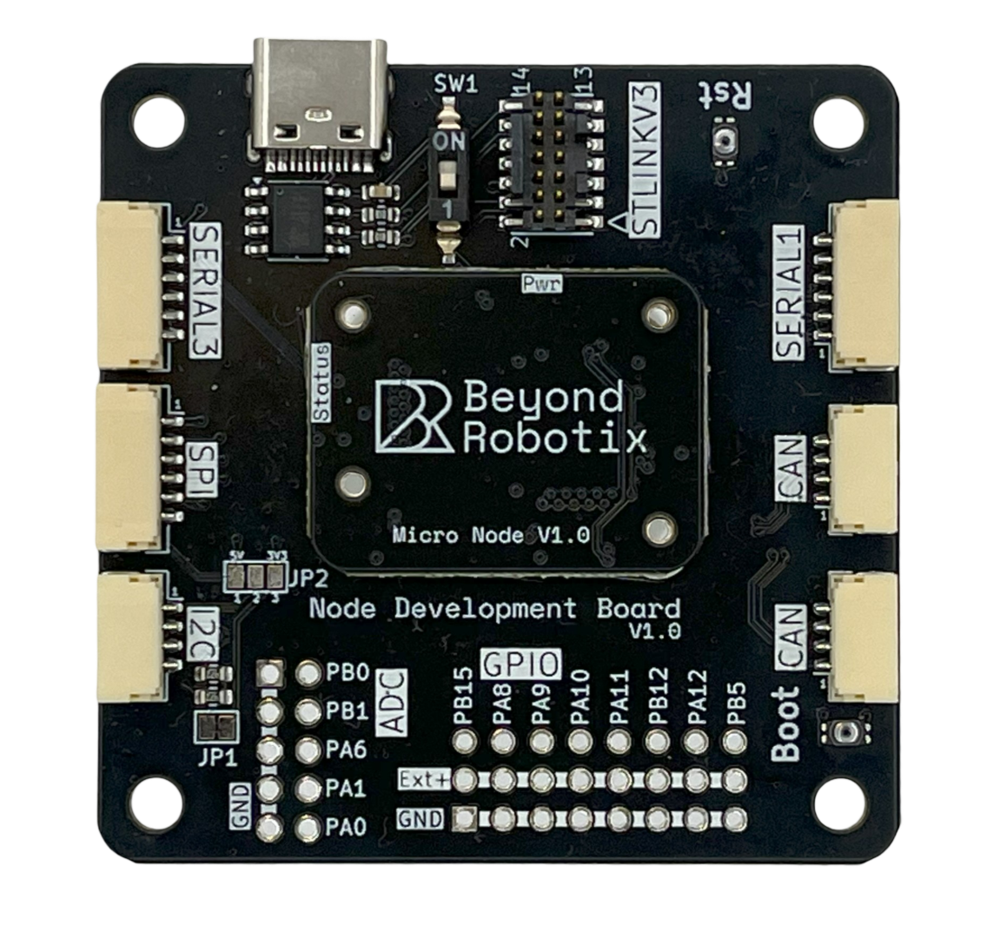

# Node Development Board

<figure><figcaption>
Node Development Board with Micro CAN Node fitted
</figcaption></figure>

This is a carrier board for the Micro CAN node.&#x20;

* The Dev carrier board is a great way of getting started using a CAN node, giving access to all the interfaces available on the node.&#x20;
* It allows easy programming of the node for custom applications, providing compatibility with debugging hardware.&#x20;
* It is also a great sensor ingestion interface for use in flight if you require lots of flexibility in development or for low unit numbers.&#x20;
* For production platforms, this board will give you the opportunity to test ideas quickly and hone in on a production carrier board design to use with the Micro CAN node.&#x20;

## Store



## Mechanical

The CAD file for the node development carrier can be found below, along with the outer and mounting dimensions of the carrier.

The holes on the carrier board are M3.



<figure><figcaption>
Carrier integration dimensions
</figcaption></figure>

## Available interfaces

The Dev board interfaces follow Pixhawk pin out standards or RC common convention where applicable. Please double check the interface pin outs for your application. We've included a lot of information on the back of the board which should help with most questions.

<figure><figcaption>
Rear of the CAN Node development board
</figcaption></figure>

### CAN

The Micro Node has 1 available CAN interface, which is pinned out to 2 JST-GH CAN ports, to allow CAN device chaining.&#x20;

| Pin Number | Description |
| ---------- | ----------- |
| 1          | Vcc (5V)    |
| 2          | CANH        |
| 3          | CANL        |
| 4          | GND         |

### I2C

The Micro Node has 1 available I2C interface,  which has been pinned out to a single JST-GH port. This has selectable 3.3V out or 5V out depending on how JP2 is set. By default, JP2 is set to 5V out.

<figure><figcaption>
Swapping 5V to 3.3V
</figcaption></figure>

To set to 3.3V out:

* Cut the trace between pad 1 and 2 on JP2
* Check there is now no continuity between pad 1 and 2
* Create a solder bridge between pad 2 and 3


The Node Development Board also has 4.7K Ohm pull ups for SCL and SDA. These can be removed by cutting JP1&#x20;


| Pin | Description      |
| --- | ---------------- |
| 1   | Vcc (5V or 3.3V) |
| 2   | SCL              |
| 3   | SDA              |
| 4   | GND              |

### SPI

The Micro Node has 1 available SPI interface, with 2 chip select pins. The dev carrier pins this interface out to a 6 pin JST-GH with 1 chip select pin.

| Pin | Description |
| --- | ----------- |
| 1   | Vcc (3.3V)  |
| 2   | SPI\_SCK    |
| 3   | SPI\_MOSI   |
| 4   | SPI\_MISO   |
| 5   | SPI\_CS1    |
| 6   | GND         |

### Serial

The Micro Node has 3 serial interfaces available. Serial 1 and 3 are pinned out to JST-GH connectors. Serial 2 is used for the USB or ST-Link interfaces on the Node Development Board.&#x20;

#### Serial 1 and Serial 3

| Pin | Description |
| --- | ----------- |
| 1   | Vcc (5V)    |
| 2   | UARTx\_TX   |
| 3   | UARTx\_RX   |
| 4   | N/C         |
| 5   | N/C         |
| 6   | GND         |

#### Serial 2

This is the program upload/console port for the Micro Node. See the STLINK header section for the pinout.

### GPIO/PWM

The Micro Node has 8 GPIO pins available. These have been pinned out into a standard 3x8 pin RC header. These pins can be used as either GPIO or PWM outputs.&#x20;

* The bottom row of pins are all connected to Ground
* The middle row of pins are all connected together. The middle pin is designated as the positive voltage terminal in RC convention. An external voltage source is required to power this row.
* The top row are the GPIO pins, see the below diagram for STM32 pin labels.&#x20;


When using Arduino DroneCAN, these pins can be accessed in your program using `PA_8` in your code for PA8


<figure><figcaption>
GPIO and ADC headers
</figcaption></figure>

### ADC


ADC pins PB0 and PB1 haven't been shown to work in testing yet


The ADC header on the board exposes 5 ADCs. A row of ground pins is situated next to the ADC pins for easy access.


The maximum voltage of the ADC pins is 3.3V.


## Programming the board

There are a few ways of interfacing with the development board, depending on what you're trying to achieve!

### ST-LINK


This is the recommended method for programming the Micro Node. It has many useful features to help debugging and makes programming easy.


STM32 allows the ability to easily debug programs over SWDIO. This allows live variable inspection, breakpoints and more - which makes program development much easier!


To use the STLINK header, the switch SW1 needs to be set to 1 to disable the onboard USB to serial


The "STLINKV3" header is directly compatible with the [STLINK-V3MINIE](https://www.st.com/en/development-tools/stlink-v3minie.html). To upload code to the Micro node, simply:

1. Connect the node to the STLINKV3
2. Click upload or debug in VS-Code!

The pins on the ST-LINK header could also be used with normal Arduino jumpers so a STLINKV2, or another SWD based debugger could be used. The pins are as follows:

<figure><figcaption>
STLINK Header
</figcaption></figure>

<table><thead><tr><th width="246">Pin Number</th><th>Description</th></tr></thead><tbody><tr><td>1</td><td><mark style="color:orange;">NC</mark></td></tr><tr><td>2</td><td><mark style="color:orange;">NC</mark></td></tr><tr><td>3</td><td>5V in</td></tr><tr><td>4</td><td>SWD</td></tr><tr><td>5</td><td><mark style="color:blue;">GND</mark></td></tr><tr><td>6</td><td>SWC</td></tr><tr><td>7</td><td><mark style="color:blue;">GND</mark></td></tr><tr><td>8</td><td><mark style="color:orange;">NC</mark></td></tr><tr><td>9</td><td><mark style="color:orange;">NC</mark></td></tr><tr><td>10</td><td><mark style="color:blue;">GND</mark></td></tr><tr><td>11</td><td><mark style="color:orange;">NC</mark></td></tr><tr><td>12</td><td><mark style="color:orange;">NC</mark></td></tr><tr><td>13</td><td>UART2_TX</td></tr><tr><td>14</td><td>UART2_RX</td></tr></tbody></table>

### Using the USB connection

The dev board comes with a USB C connection and has a built in USB to UART converter to be able to communicate with our CAN node. This can be used to program the CAN node over serial. The CAN node needs to be in boot loader mode to do this.&#x20;


To use the onboard USB connection, the USB switch needs to be set to ON


To put the CAN node into boot loader mode:

1. Hold down the boot loader button
2. press the reset button

Once in boot loader mode, you can use&#x20;

1. STM cube programmer to upload AP\_Periph firmware over serial [https://www.st.com/en/development-tools/stm32cubeprog.html](https://www.st.com/en/development-tools/stm32cubeprog.html)
2. PlatformIO for Arduino DroneCAN projects. Currently serial upload isn't working in PlatformIO, the generated .Bin file needs to be uploaded through STM32CubeProgrammer selecting "serial" connection method.
3. Other tool chains!
