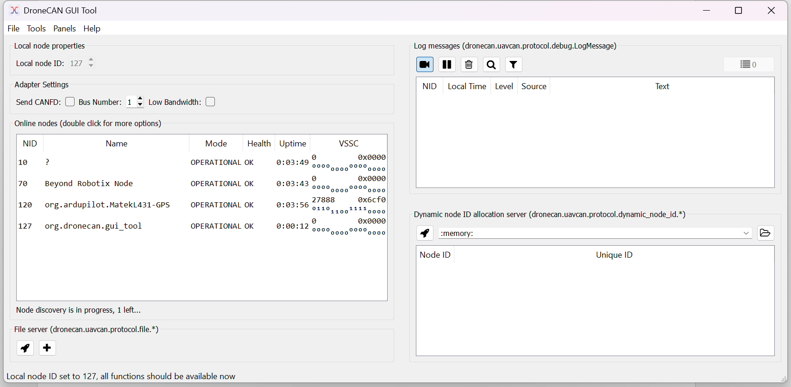

# Thermocouple tutorial

Want to integrate a sensor into Ardupilot or PX4? Arduino DroneCAN and the Beyond Robotix CAN node let you do that very quickly. This tutorial runs through integrating the Adafruit MCP9600 thermocouple sensor, resulting in us being able to send temperature messages over DroneCAN. The big advantage of using the Arduino framework is access to Arduino libraries. Almost always, there are libraries available for the sensor you want to use. This saves development time. The Arduino framework is also simple to work with, and the Platformio + VS code platform allows easy development from small to complicated projects.

Using custom firmware allows lots of options, such as integrating a battery monitor + thermocouple and sending all the information with one device in one message. You could action tasks based on the thermocouple onboard the node, e.g. opening a hatch if the battery is getting too hot.

You could integrate GPS receivers, new airspeed sensors, fuel sensors, gas sensors, ESCs and servo nodes.


### Hardware Requirements:

* Beyond Robotix CAN node Dev kit
* A CAN enabled flight controller or sniffer
* Windows PC is assumed but other OS’s will apply there might just be some minor adjustments needed
* Adafruit MCP9600 + thermocouple


### Getting started

To start, we should download the latest release of ArduinoDroneCAN from:



The code we will run through is in examples/thermocouple-mcp9600 which is here:



We’ll need to download a few things to work with the software. We’ve got these setup instructions on our documentation site here:




We’ll also need to get our hardware setup. You’ll need a DroneCAN compatible flight controller or sniffer. We’ll use a Cube Orange. Then connect your Beyond Robotix CAN node to the flight controller via a CAN cable. Also connect your STLINK to the debug port on the CAN node.

\[PICTURE of setup]

With the repository downloaded and our tools installed, we can build the default example to make sure it’s all working correctly.

<figure><figcaption></figcaption></figure>

You should then see “SUCCESS” shown in the terminal. If you don’t, make sure your STLINK is connected correctly and power is being given to the CAN node via the flight controller.

<figure><figcaption></figcaption></figure>

We can now see what CAN messages are being sent by the Node. We’ll use DroneCAN GUI tool in this example, however, Mission Planner can also be used for CAN packet inspection. [https://dronecan.github.io/GUI\_Tool/Overview/](https://dronecan.github.io/GUI_Tool/Overview/)

<figure><figcaption></figcaption></figure>

Once connected, we’ll see our Node showing in the list, (you may need to set the Local node ID, press the tick in the top left ish)

<figure><figcaption></figcaption></figure>

We can see the example parameters in Node properties:

<figure><figcaption></figcaption></figure>

And we can also see the battery message being sent

(which can be found in tools->subscriber)

<figure><figcaption></figcaption></figure>

We can see the temperature field which responds to the built in MCU temperature sensor. “voltage” and “current” are showing the raw ADC values from PA1 and PA0 respectively.


### Getting MCP9600 data

We’ve chosen to use the Adafruit library, although there are a few MCP9600 libraries to choose from. Download the latest release, unzip and add it to the “lib” folder. Make sure there are no nested folders! The library can also be installed from the platformio library manager. The “BusIO” library is also needed. Platformio may install this for you.






Let's have a look at their example..



They import the files, set the i2c address and setup the mcp object. We had to set the address to 0x66 for the MCP9600 we had.

```cpp
#include <Wire.h>
#include <Adafruit_I2CDevice.h>
#include <Adafruit_I2CRegister.h>
#include "Adafruit_MCP9600.h"

#define I2C_ADDRESS (0x67)

Adafruit_MCP9600 mcp;
```

We then call .begin method

```cpp
 /* Initialise the driver with I2C_ADDRESS and the default I2C bus. */
if (! mcp.begin(I2C_ADDRESS)) {
  Serial.println("Sensor not found. Check wiring!");
  while (1);
}
```

then, they have a bunch of other options but the two we're interested in for the basics:

```cpp
 // set our thermocouple type
 mcp.setThermocoupleType(MCP9600_TYPE_K);
 
 // take a temperature measurement
 mcp.readThermocouple()
```

So, with this information, we can now write our DroneCAN application.


In setup(), we wrote code to initialise the MCP9600, and send some CAN debug messages and serial messages if it doesn't initialise properly.

Some key design patterns here, don't use delay() as this stops our program from processing CAN packets and can cause all sorts of problems. Instead, we setup a statment that only runs once a timer counts to 1000ms. When not meeting this condition, it always calls "dronecan.cycle()" which processes CAN frames in the background and "IWatchdog.reload()" which ensures our watchdog doesn't reset.

```cpp
if (!mcp.begin(I2C_ADDRESS))
{
    uint32_t deadloop = 0;
    while (1)
    {
        const uint32_t now = millis();
        if (now - deadloop > 1000)
        {
            deadloop = millis();
            dronecan.debug("MCP9600 not found", 0);
            Serial.println("Sensor not found. Check wiring!");
        }
        dronecan.cycle();
        IWatchdog.reload();
    }
}

// Set the thermocouple type
mcp.setThermocoupleType(MCP9600_TYPE_K);

```

Now, in the example, we've written in some logic which lets you send either a temperature packet or a battery packet depending on some parameters. At the core of it, we send a DroneCAN message like this:

```cpp
uavcan_equipment_device_Temperature pkt{};

pkt.temperature = mcp.readThermocouple();
pkt.device_id = device_id;

sendUavcanMsg(dronecan.canard, pkt);
```

We can see that we read in our thermocouple measurement, and put it into a Temperature packet. You can see the packets availible here:



Although there are lots of different types of packets, not all are actually understood by PX4 or Ardupilot, so you'll have to do some research on the appropriate packet to use. If you get stuck you can contact us at **admin@beyondrobotix.com**

We also set the device\_id, which we pull from a parameter in a different part of the loop. This is used by Ardupilot to identify which battery instance to put the temperature into.

We then do our "sendUavcanMsg" which queues our packet.&#x20;

And there we go! if you compile our example, you'll see either battery or temperature packets coming through depending on the parameters set.

We can create fairly complex features easily : - ) If you use the library and/or CAN node in your project, we'd be keen to hear about it! contact us at **admin@beyondrobotix.com**
