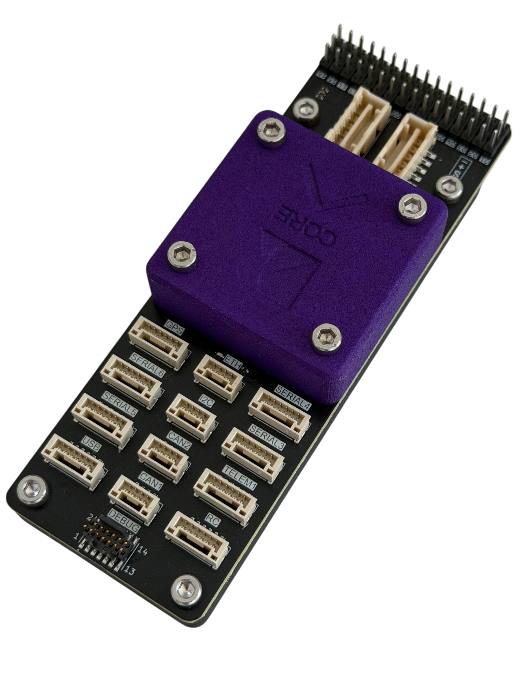
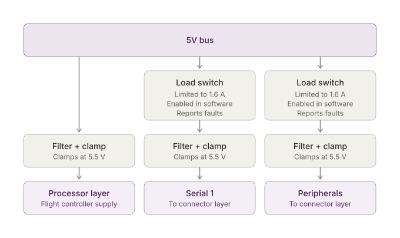

# Core Autopilot

<figure style="text-align: center"><figcaption>
Core
</figcaption></figure>

The Beyond Robotix Core is an Ardupilot and PX4 compatible autopilot, aimed to increase the flexibility and number of interfaces over other solutions whilst being simple to integrate into any drone. 16 PWMs, Ethernet, 7 serials, 2 CAN and I2C all contribute to ensure you can achieve what you need to.

The Core integrates all power conditioning and switching within the core, so a carrier board only needs to route from the high density connectors to the carrier outputs.

## Sensors

The core contains tripple redundant IMUs, dual barometers and a single Magnetometer. All sensors are heated using a 2W heater to ensure they operate consistently in any scenario. The 2W heater is able to bring the sensors to working temperature within minutes even at extreme cold temperatures. 

| Sensor       | Part                      |
| ------------ | ------------------------- |
| IMU          | 2× IIM-42652, 1× BMI088   |
| Barometer    | 2× MS5611                 |
| Magnetometer | 1× BMM350                 |

## Power

The Core accepts power through 4 interfaces
- USB C
- USB JST-GH header
- Power 1
- Power 2

The following applies to the inputs:
- All inputs and all outgoing 5 V rails are clamped at 5.5 V against transients
- Every input is filtered and reverse-blocked
- The highest voltage input is used, or, similar voltage sources are shared.
- The power inputs expect a 4.8V-5.75V input, with a recommended input of 5.3V.

### Power outputs
The core has 3 power lanes. One directly for the processor which is the priority, then 2 avionics lanes, Telem and peripherals. 

<figure><figcaption>
5V bus distribution on the power layer
</figcaption></figure>

### Redundancy behaviour

Each input is independently protected and reverse-blocked. A source that fails, is disconnected, or drops outside the accepted voltage window is isolated automatically, without disturbing the others and without back-feeding the board or another source. Changeover requires no configuration, and the board continues on whatever remains.

## Connectivity

- 2x CAN interfaces
- Ethernet
- USB
- microSD
- SWD/JTAG debug
- 7 Serial
- I2C


USB signals are common between the USB-C connector on the side of the core and the USB connector on the connector layer.


- All digital signal lines have ESD protection 
- Analogue inputs are series-protected and filtered

## Mechanical

Carrier board mechanical (outline, mounting holes, STEP file) is covered on the [Default Carrier](default-carrier-pinout.md#mechanical) page.

