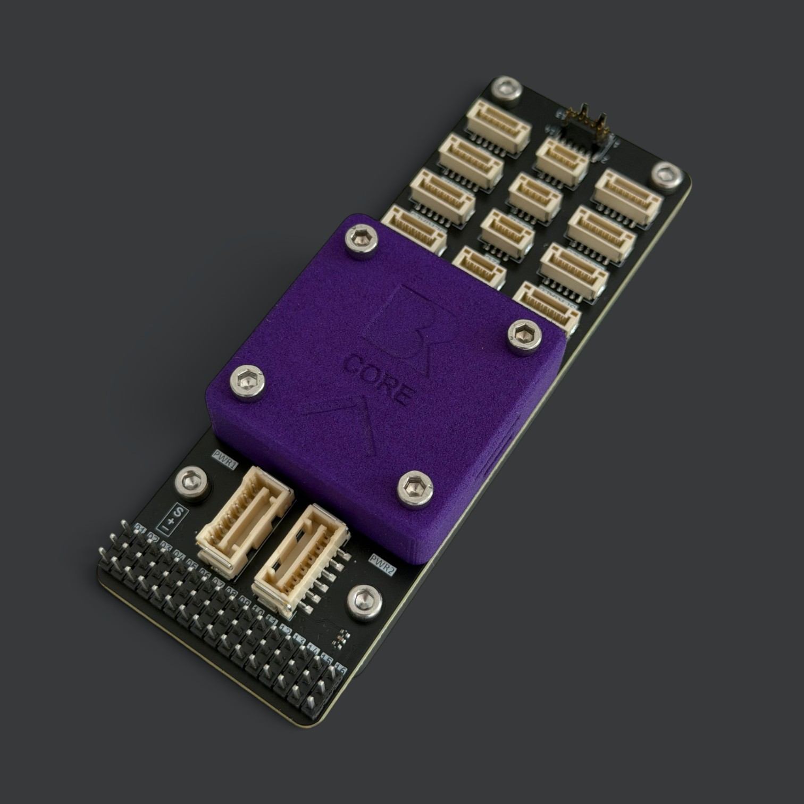
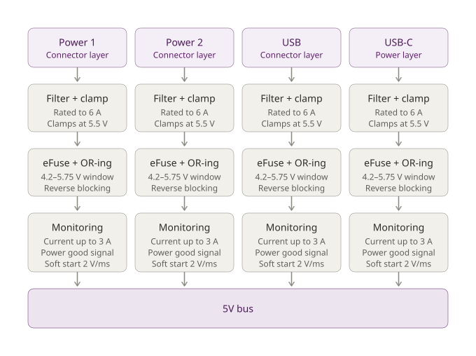

# Core Autopilot

<figure style="text-align: center"><figcaption></figcaption></figure>

# Stack Architecture

BR Core is a stacked FMU design, with three boards joined by high-density Hirose DF40C 80 pin board-to-board connectors:

| Layer | Role |
| --- | --- |
| Processor Layer | Flight computer, IMUs, barometers, magnetometer, CAN/Ethernet/USB/microSD interfaces |
| Power Layer | Input redundancy, protection, monitoring |
| Connector Layer | User-facing I/O breakout |

They stack top to bottom in that order: Processor Layer → Power Layer → Connector Layer.

A separate, standalone Power Module (an external brick with a 1 mΩ current-sense shunt, rated to roughly 160 A) feeds power into the stack. It's a companion board rather than part of the stack itself.

# Processor Layer

The top layer of the stack, and the flight computer for the whole board.

### Core

STM32H743XIHx MCU, running from a 24 MHz crystal.

### Sensors

Redundant IMU and attitude sensing:

| Sensor | Part | Notes |
| --- | --- | --- |
| IMU | 2× IIM-42652 | Primary, dual redundant |
| IMU | 1× BMI088 | Secondary, for triple redundancy overall |
| Barometer | 2× MS5607-02BA | Redundant |
| Magnetometer | 1× BMM350 | |

### Connectivity

- Dual CAN transceivers
- Ethernet PHY
- USB
- microSD
- SWD/JTAG debug


USB signals are common between the USB-C connector on the side of the core and the USB connector on the connector layer.


### Monitoring and indicators

VBUS and VSERVO monitor ADC inputs, status/indicator LEDs, and a heater enable output for sensor thermal stability.

# Power Layer

What BR Core expects from your power system, and what it can supply to your peripherals.

## Electrical characteristics

| Parameter | Minimum | Typical | Maximum | Unit | Notes |
| --- | --- | --- | --- | --- | --- |
| Input voltage | 4.2 | 5.15 | 5.75 | V | Per input; outside this window the input is isolated |
| TELEM rail voltage | – | 5 | – | V | Software enable |
| TELEM rail current limit | – | – | 1.6 | A | Software enable |
| Peripheral rail voltage | – | 5 | – | V | Software enable |
| Peripheral rail current limit | – | – | 1.6 | A | Software enable |
| Flight controller current | – | 0.4 | 0.8 | A | 2 W idle, 4 W with IMU heaters active, at 5 V |

## Powering the board

BR Core accepts four independent 5 V sources. All four connect through the connector layer, except the USB-C receptacle, which is on the power layer itself.

- Power 1
- Power 2
- USB, via the connector layer
- USB-C, directly on the board

You do not need to select between them. Any combination can be connected at once, and the board draws from whichever are live.

<figure><figcaption>
Four power sources filtered, fused and monitored before merging onto the 5V bus
</figcaption></figure>

### Redundancy behaviour

Each input is independently protected and reverse-blocked. A source that fails, is disconnected, or drops outside the accepted voltage window is isolated automatically, without disturbing the others and without back-feeding the board or another source. Changeover requires no configuration, and the board continues on whatever remains.

Nominal 5.15 V supplies are expected; the window is deliberately tight, so a supply sagging below 4.2 V under load will be dropped.

## Power available to peripherals

Two power rails leave the board through the connector layer: TELEM and Peripherals.

<figure><figcaption>
5V bus distribution on the power layer
</figcaption></figure>

High-current servo and actuator power should be supplied externally, not drawn from the board.

The two switched rails (TELEM and Peripherals) are independently controlled. Disabling the peripheral rail does not affect TELEM, and neither affects the flight controller supply, which is unswitched and always live while any input is present.

### Overcurrent behaviour

Each switched rail reports a fault to the flight controller when it trips. A short or overload on one rail does not bring down the other, nor the flight controller.

## Protection

- All inputs and all outgoing 5 V rails are clamped at 5.5 V against transients
- Every input is filtered and reverse-blocked
- All digital signal lines have ESD protection 
- Analogue inputs are series-protected and filtered

# Connector Layer

The bottom layer of the stack, and the user-facing I/O breakout. Full pin-by-pin detail lives in [Advanced Configuration](advanced-configuration.md).

### Serial ports

Seven UART headers (RC, TELEM, SERIAL3–6, GPS), all JST-GH 6-pin sockets following the same 5V / TX / RX / [flow control or I²C] / GND pattern, mapped to USART1–8 on the MCU.

- **TELEM** sits on its own switched, current-limited 5V rail, separate from the shared Peripherals rail the other ports use — pick it for a telemetry radio if you want that isolation.
- **RC**, **SERIAL4** and **SERIAL5** only break out TX/RX/5V/GND, with no flow control — they suit GPS-type or simple peripherals rather than a flow-controlled radio.
- **SERIAL3** has full CTS/RTS flow control, making it the port to use for a second flow-controlled radio.
- **GPS** repurposes the flow-control pins as I²C (SCL/SDA) — a combined UART + I²C port, intended for a GPS module with an onboard compass.

### CAN

Two CAN buses, each a 4-pin socket with 120 Ω termination fitted and jumper-selectable — useful if the board sits mid-bus rather than at an end.

### I²C, Ethernet, USB

- A dedicated I²C breakout, in addition to the I²C carried on the GPS port
- Ethernet as raw differential pairs only — no power pin, since the magnetics and bias live on the Processor Layer
- USB, for GCS connection

### Power in

Two redundant 6-pin power inputs. Both pair their supply pins with CAN2, rather than an analogue sense line — intended for DroneCAN-capable smart power modules that report battery voltage and current over CAN, with the two redundant inputs sharing that one CAN2 bus.

### PWM / servo outputs

A 16-pin header has signal, power and ground. Servo power is not supplied by the board however the MCU monitors the voltage on the servo power bus. The first 8 PWMs pass through a level shifter, which can be changed from 3.3 V to 5 V by setting a parameter. The MCU drives 18 PWM channels in total, but only 16 are broken out here. 

### Debug

A 14-pin SWD/JTAG connector that also carries a UART8 console — a standard bench-debug port doubling as a serial console for boot and log output.

### Mechanical

Two board-to-board connectors mate upward to the Power Layer, eight mounting holes across two groups, and one status LED. On the bottom side of the connector layer are 4 M3 surface-mounted nuts, which are used to fix the power and processor layer to the connector layer. 

