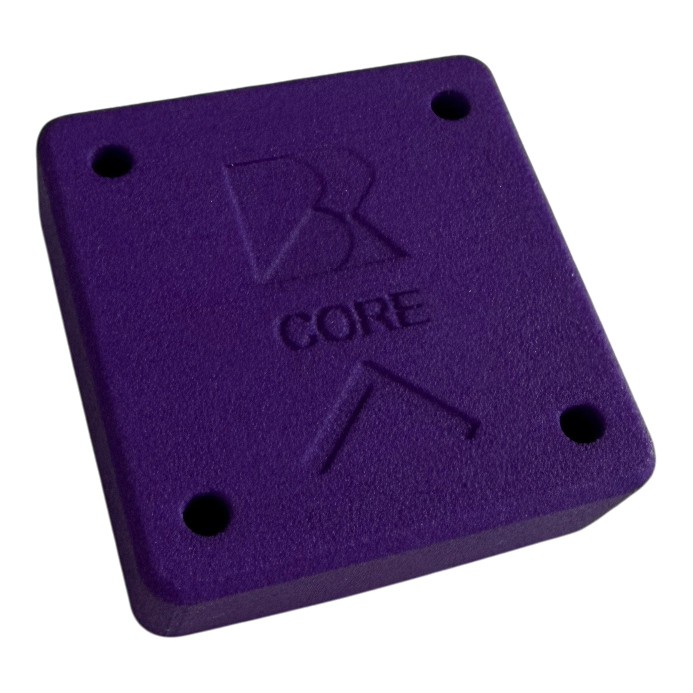
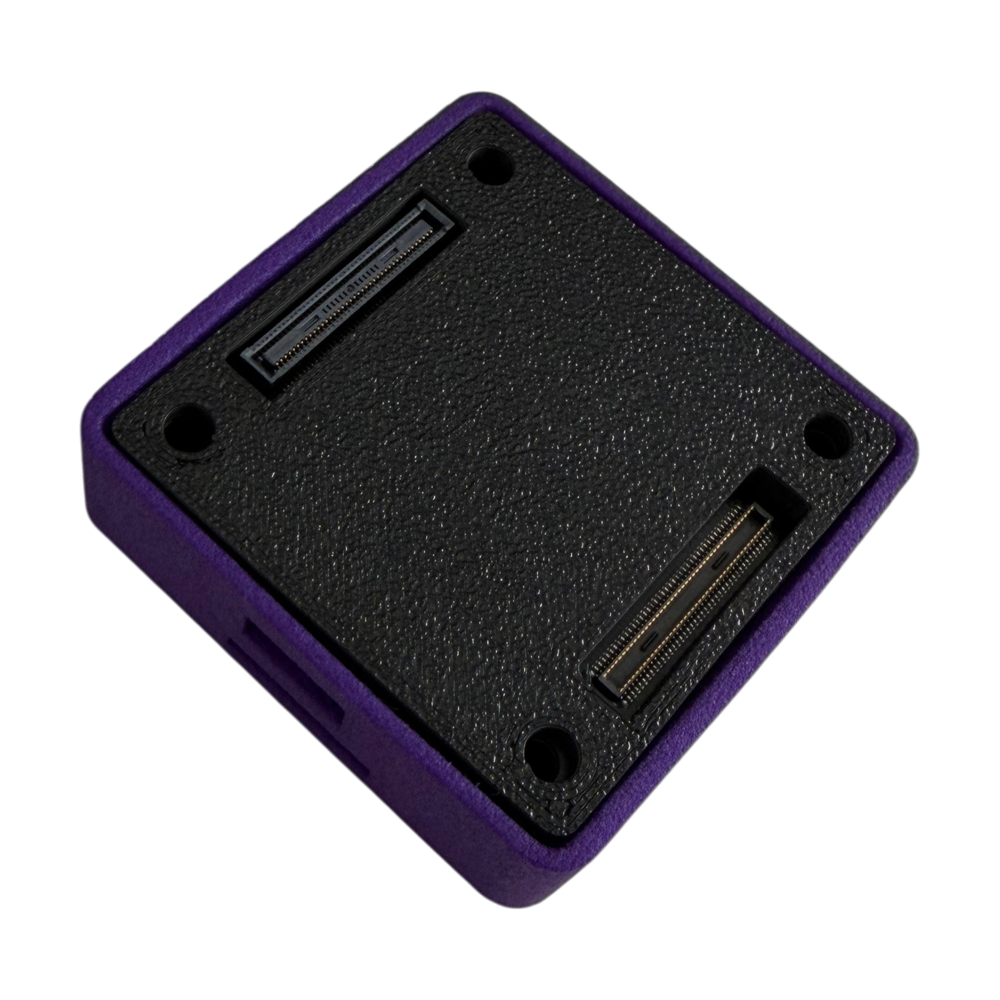

# Core pinout

This page is under construction. Please contact admin@beyondrobotix.com for further information.


This page is for integrating the core into your own carrier board. No licensing required! Since our core has all the power switching electronics in the core, producing a custom carrier becomes just routing the connector pins.

<figure><figcaption>
Top
</figcaption></figure> <figure><figcaption>
Bottom
</figcaption></figure>

