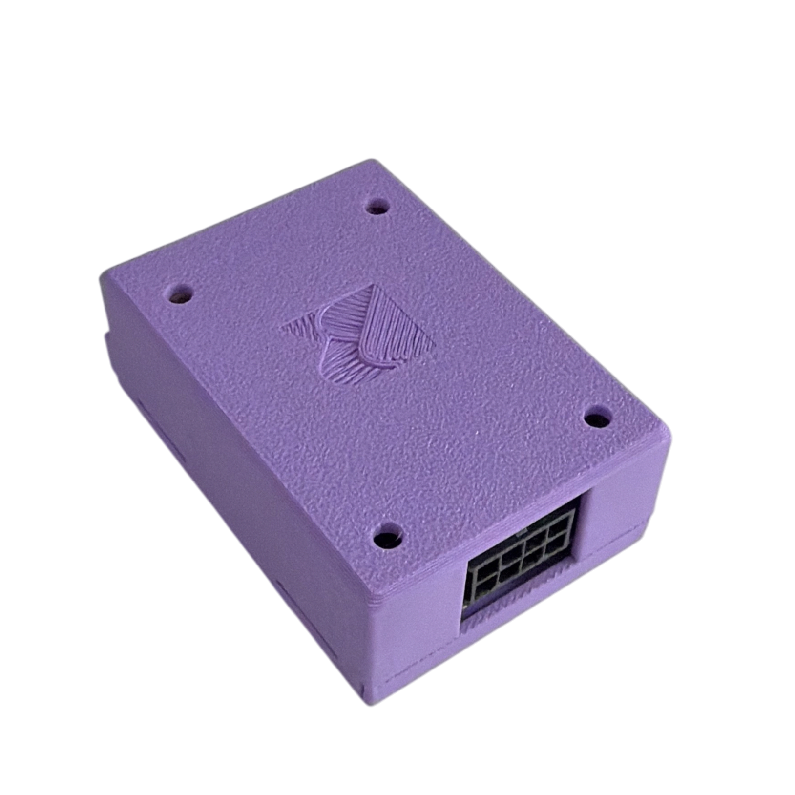
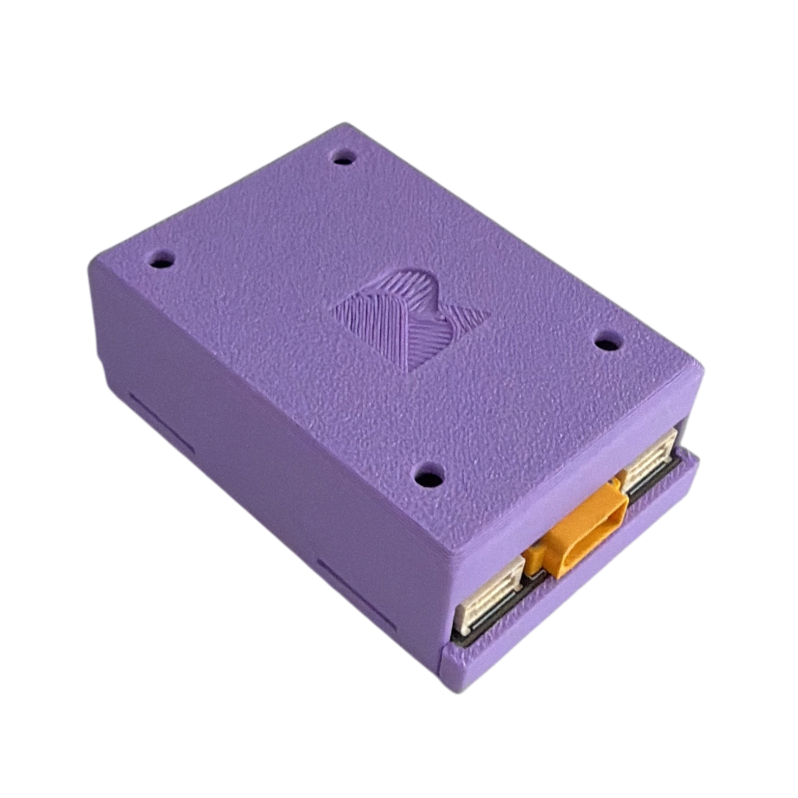
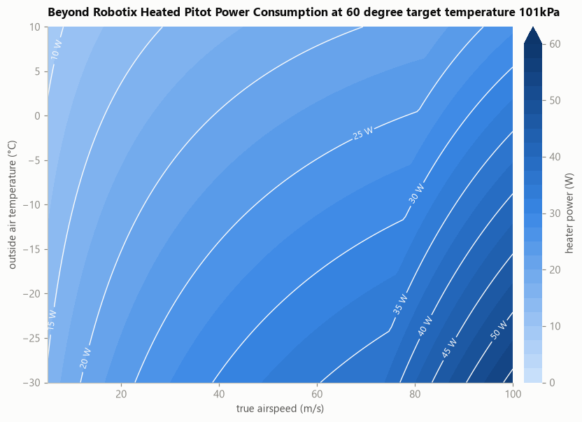

# Heated Pitot


This page is under construction. Please contact admin@beyondrobotix.com for further information.


The Beyond Robotix Heated Pitot allows aircraft to continue reading airspeed during extreme icing and wet conditions. It's able to operate at high airspeeds, with significant heating power on demand if required. The probe integrates our AUAV airspeed sensor module, for altitude and airspeed estimates over wide speed range options. DroneCAN is used for readings and optional control, with support for both Ardupilot and PX4. Our electronics allow precise power control, meaning your avionics system is not put under stress even when high heating power is required.

<figure><figcaption></figcaption></figure> <figure><figcaption></figcaption></figure>

For large volume orders, we can support custom options:
- loom length between control module and pitot
- Tube length to the probe
- Custom mounts

## Mechanical

### Probe 



### Control module

<figure><figcaption></figcaption></figure>



## Electrical

<figure><figcaption></figcaption></figure>


Below 12V, the maximum available heater power output will reduce. The pitot may operate down to 9V. Below 12V operation is not recommended.


| Parameter                   | Value                        |
| --------------------------- | ---------------------------- |
| Input Voltage Range         | 12 - 53 V                     |
| Maximum Power Consumption   | 70 W (settable, see `P_MAX`) |
| Standby Power               | 1 W                          |
| Operating Temperature Range | -40 °C to +80 °C             |
| Power Connector             | XT30                         |
| 5V / CAN Connector          | 2x standard 4 pin JST-GH     |

### Power Consumption

The pitot targets a set temperature and adjusts heater power output to meet temperature demand. We recommend a 60 degree target temperature to ensure ice is melted as quickly as possible. For this given target temperature, the power output varies depending on airspeed, atmospheric temperature, altitude, snow/water air content.

The following shows power consumption varying with airspeed and atmospheric temperature at sea level, assuming dry conditions. To factor in melting ice, an additional 5W to all figures should be added to compensate for this.

<figure><figcaption></figcaption></figure>

Some advanced parameters can be set to reduce power consumption depending on your operating scenaio. See below and contact admin@beyondrobotix.com if you would like to discuss.


[parameters.md](parameters.md)


