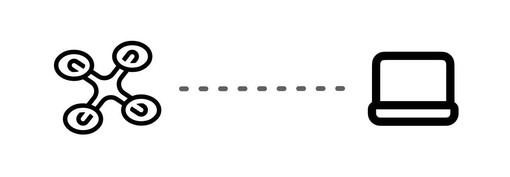
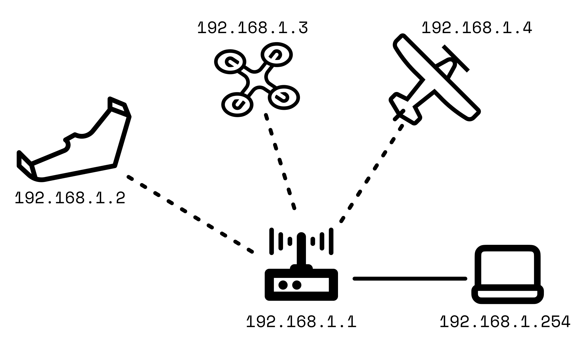

# Further Configuration

## General

To update or find any settings, you are able to do this using any browser by going to 192.168.4.1 while connected to the Kahuna. From this page you will be able to update any settings, find the IP and port number of the Kahuna and update the firmware. Ensure you save and reboot to utilize any changes.

## Access Point Mode

Use Access Point Mode (the default setting) to allow the Kahuna to create its own Wi-Fi network. This enables any Wi-Fi enabled device with ground control software, like Mission Planner or QGroundControl to connect to your autopilot.

<figure><figcaption>
Kahuna is the host of a Wifi network between GCS and UAV. 
</figcaption></figure>

## Station Mode

Station mode enables Kahuna to connect to an already established Wi-Fi Access Point. This is useful to communicate with multiple Kahuna units at a time.&#x20;

<figure><figcaption>
Simple Multi UAV System on one network. Each vehicle requires a Kahuna connected to their respective autopilots. These are connected the the router, which forwards all traffic to the GCS computer. The router is the host in Station Mode.
</figcaption></figure>


When a Kahuna is powered on in Station Mode and cannot find a Router (or another access point) within 1 minute, it will switch to Access Point Mode. Rebooting will reset it to Station Mode.&#x20;


### Basic Set Up

Set up each Kahuna with the settings below. Station SSID and Station Password are the settings used to connect to the router.

<figure><figcaption>
Kahuna Web GUI for basic set up for station mode
</figcaption></figure>

After saving these parameters, reboot the Kahuna and it will search for the router. If the Kahuna and GCS computer are both connected to the router, the Autopilot will show up in Mission Planner or QGroundControl.

### Advanced Set Up

The following settings should only be changed if required.&#x20;

**Baud Rate**

This is the speed at which the Kahuna communicates with the autopilot. Most autopilots use 57600 as their default serial baud rate. Make sure to update both autopilot and Kahuna if you want to change this value.

**Host port**

This is the port that the Kahuna will send telemetry to on the GCS. QGroundControl and Mission planner both open this port automatically, therefore if everything is set up correctly, they should auto-connect. If the GCS software doesn't automatically connect to the autopilot, check your firewall settings.


A useful tool for seeing network communications is [WireShark](https://www.wireshark.org/). This is a very good tool for seeing all the traffic on a network.


**Client Port**

This is the port that the Kahuna will send data from (and expect a response to).&#x20;

**Station IP**

This is the IP address that the Kahuna will have when it joins the network. When you have multiple UAVs connected to a router, give all the Kahuna's unique IP addresses. You will be able to access the Web GUI from this address.


Make sure the IP address is unique as the Kahuna will not deconflict.&#x20;


**Station Gateway**

This is the IP address of your modem/router. Use this if you want to send a telemetry stream over the internet. You will need to set up port forwarding in your router to do this.&#x20;

**Station Subnet**

This is the subnet mask of the Kahuna. If your GCS and Kahuna are on the same subnet (For example, Kahuna is 192.168.1.20 and GCS is 192.168.1.50) you can use the subnet mask 255.255.255.0.

**Wi-Fi Channel**

This is the channel the Kahuna uses to communicate with the rest of the network.&#x20;


Best practice is to use channels 1-11. Channels 12-14 should be used only if not prohibited in your region. Check [here](https://en.wikipedia.org/wiki/List_of_WLAN_channels) for more details.

