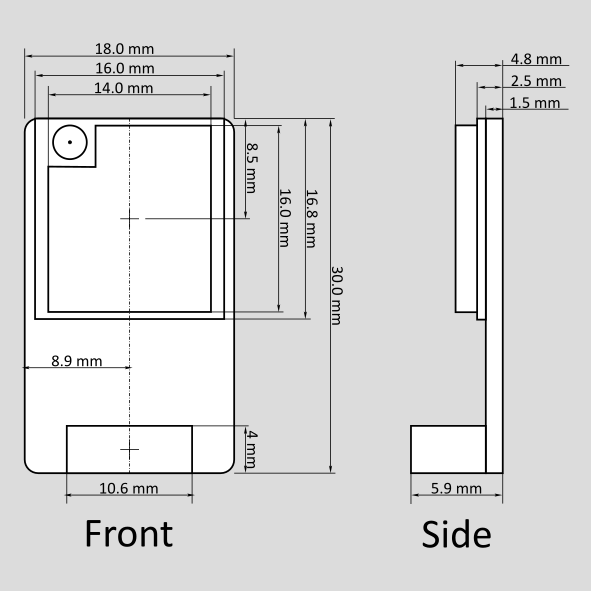

# Hardware

## Pinouts

The connector to the autopilot is a 6-pin JST-GH connector. The pinouts on the Kahuna are inline with the pixhawk standard, hence an unmodified 6-pin JST-GH can be connected directly to any pixhawk standard autopilot. The TX and RX have been swapped appropriately on the Kahuna for a UART connection.&#x20;

The antenna connector is a U.Fl connector (Also known as IPEX). You can connect an antenna directly to the board or use a U.Fl to SMA adaptor to connect to a wider range of antennas.

<figure><figcaption>
Kahuna Pinout
</figcaption></figure>

## Buttons and Jumpers

Use the Kahuna's buttons and jumpers to enter bootloader mode or restore factory settings.

### Enter Bootloader Mode

To enter bootloader mode on the ESP07-S module, hold the **B** button and quickly tap the **R** button. If successful, the GCS Status LED will softly illuminate. Release the button when the LED lights up. For detailed steps on checking the module's health and firmware updates via UART, refer to the Firmware Update

### Factory Reset Jumper

The factory reset jumper lets you restore the Kahuna to its default settings, which is helpful if you've forgotten the username or password. To reset to factory defaults, short circuit the jumper on the underside of the board within one minute of powering on the Kahuna.

## LED Status Lights

The Kahuna device features three status indicators: Air, Wi-Fi, and GCS.

* **Air LED**: Indicates the status of communications between the Kahuna and the autopilot, specifically regarding the presence of a heartbeat.
* **Wi-Fi LED**: Shows the status of the Wi-Fi connection, for instance, whether the Kahuna is connected to a network or searching for one.
* **GCS LED**: Reflects the communication status between the Kahuna and the Ground Control Station software, again focusing on the presence of a heartbeat signal.

The table below outlines the meaning of the status light indications.

<figure><figcaption>
LED Status Definitions*
</figcaption></figure>

\*Kahuna V1.1 have GCS and Air labels swapped.

## Specifications

| Mass               | 4g                |
| ------------------ | ----------------- |
| Max output power   | 20 dBm (\~112 mW) |
| Range              | 2500 m            |
| Voltage input      | 5V                |
| Current Continuous | 20 mA             |
| Current Peak       | 250 mA            |

<figure><figcaption>
Physical Dimensions of the Kahuna
</figcaption></figure>


CAD file for the Kahuna


## 3D Printed Case

<figure><figcaption>
Render of Case
</figcaption></figure>

<figure><figcaption>
Kahuna in Case
</figcaption></figure>

Files are available to download and print here:





If you want to edit the parts, the raw files are here:




