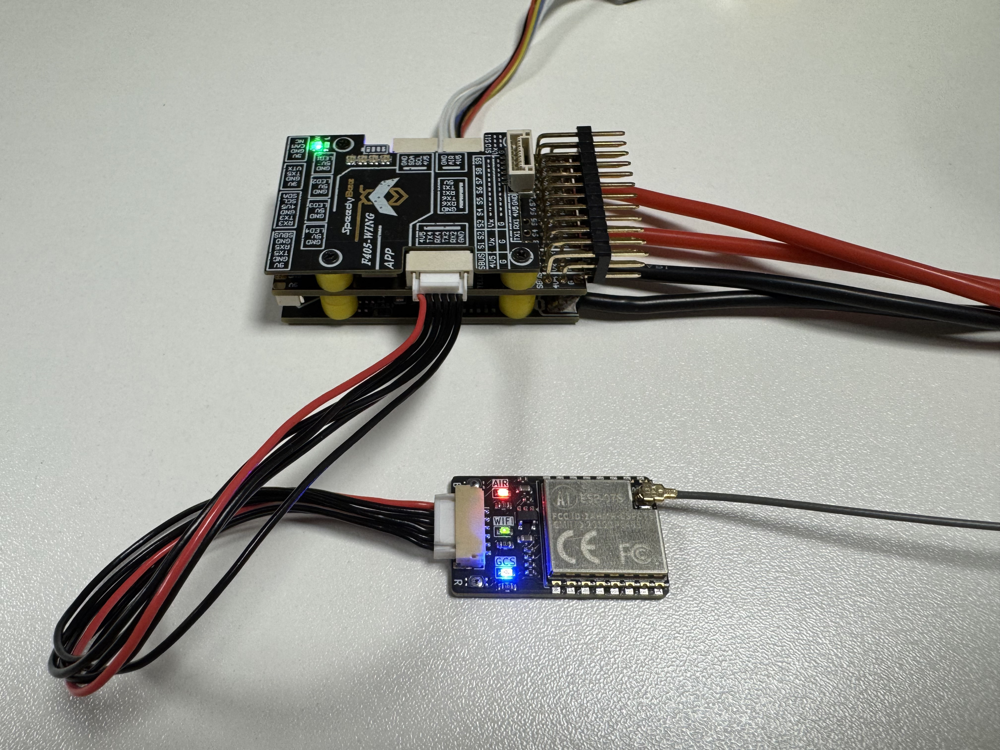
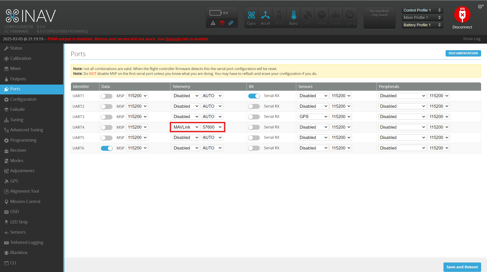
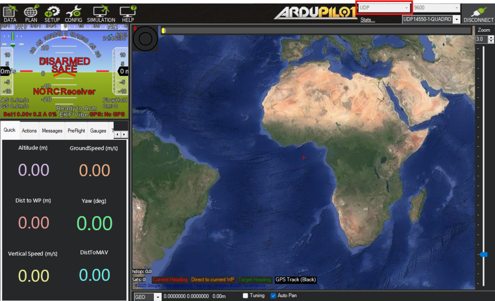

# INAV Setup

INAV supports MAVLink in a limited capacity, meaning the Kahuna can be used to view telemetry on a ground station. Flight controllers running INAV can transmit telemetry over MAVLink but cannot receive commands.

#### Step 1:

Connect the Kahuna to a free UART on your autopilot.

<figure><figcaption></figcaption></figure>

#### Step 2:

Plug your flight controller into your PC via USB, open INAV Configurator and press Connect.

#### Step 3:

Navigate to the Ports tab on the left of the screen and select MAVLink from the telemetry dropdown of the UART you are using (in this case UART4). Set the baud rate to the baud rate of the Kahuna (Default: 57600). Press Save and Reboot to apply the change.

<figure><figcaption></figcaption></figure>

#### Step 4:

Connect your GCS Wi-Fi to the Kahuna \
&#xNAN;_&#x53;SID: BeyondRobotix_\
_Password: beyondrobotix_\
&#xNAN;_(Remember - the password has no capitals)_

#### _Step 5:_

Open Mission Planner, select UDP from the dropdown in the top right corner and press connect. A dialog will open asking you to choose a port, 14550 will already be entered which is the default for the Kahuna. If you have not changed this on the Kahuna setup page you can press OK.

<figure><figcaption></figcaption></figure>

You should now see live updates in the artificial horizon when you move your flight controller.


Remember, INAV does not support sending commands over MAVLink, if you attempt to do so the interface will lock up for a few seconds and then show a no response from MAV error message.

