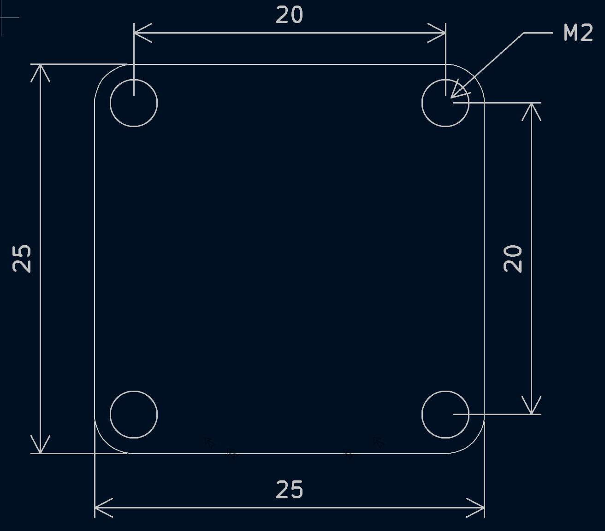

# RM3100 DroneCAN Compass

## Introduction

The RM3100 DroneCAN Compass Node uses the [PNI RM3100 Magnotometer](https://www.pnisensor.com/rm3100/) and sends compass messages over DroneCAN back to a flight controller. The node works on a regular DroneCAN bus and is completely plug and play.

<figure><figcaption></figcaption></figure>

### Features 

* STM32L431 Processor - Fast and Capable
* PNI RM3100 Magnetometer - Highly accurate and low cost
* Over and Under Voltage Protection - Prevents adverse readings during surges&#x20;
* Over Current Protection - Prevents CAN bus interference in case of node failure
* Reverse Polarity Protection
* ESD Protection
* Enable-able CAN Terminating Resistor
* Pixhawk Standard JST-GH Connector
* Pads for I2C, Serial and CAN Interfaces Exposed

## Specifications

* Typical 22mA (4.5 - 5.5 V)
* 25 x 25 mm, \~ 6g Mass
* M2 Mounting Holes
* Temp Range: -40 °C to +85 °C

### Pinout 

The JST-GH 4 Pin connector on the top of the board is pinned out using the Pixhawk convention:

| Pin | Function |
| --- | -------- |
| 1   | 5V       |
| 2   | CAN H    |
| 3   | CAN L    |
| 4   | GND      |

## Parameters

The following parameters should be used for the Flight Controller. For an initial set up, plug the Node into CAN1 on your flight controller and set the following parameters.

| Parameter         | Value |
| ----------------- | ----- |
| CAN\_P1\_DRIVER   | 1     |
| CAN\_D1\_PROTOCOL | 1     |

For advanced compass configurations on ardupilot, refer to these [instructions](https://ardupilot.org/copter/docs/common-compass-setup-advanced.html).

## Mechanical

Mechanical design of the PCB and STEP file.

<figure><figcaption></figcaption></figure>


